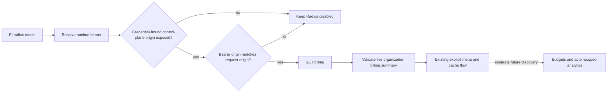

# Add Radius support to pi-usage

## Goal

Determine when `@narumitw/pi-usage` can safely report Radius organization billing and spending budgets for Pi provider ID `radius`, and enable only the scopes whose data and credential-origin contracts are proven.

The current decision is **blocked**: Radius now exposes a suitable live organization billing summary, but Pi 0.86.0 still does not expose the credential-bound Radius control-plane origin needed to send its bearer safely. Budget remaining has additional unresolved applicability and consumption contracts.

This plan covers only the Radius portion of [issue #1051](https://github.com/narumiruna/pi-extensions/issues/1051).

## Context

Pi supports the built-in Radius gateway at `https://radius.pi.dev` and custom gateways declared with `oauth: "radius"`. The model inference `baseUrl` can come from gateway-returned config and does not necessarily identify the OAuth control-plane gateway.

### 2026-09-20 assessment

The assessment revalidated Pi 0.86.0 at [`ecac0a9`](https://github.com/earendil-works/pi/tree/ecac0a9c4edad3dac5d9f8b40e0c7db7a56471fc) and the live Radius OpenAPI 3.1 document, whose advertised API version remains `1.0.0`.

Radius now exposes [`GET /v1/billing`](https://radius.pi.dev/v1/meta/operations/billing.summary.read). Its documented owner, admin, and member response contains:

- live organization `credit_balance`, `reserved`, and `available` amounts;
- finalized actual charges and charge counts for the current UTC month;
- all-time credited and finalized actual-charge totals;
- `as_of` and balance `updated_at` timestamps; and
- explicit notes that recent usage settles asynchronously while the live balance remains authoritative.

This endpoint removes the need to query delayed organization analytics merely to show an organization billing summary. It does not provide per-budget consumption or applicability.

[`GET /v1/budgets`](https://radius.pi.dev/v1/meta/operations/budgets.list) now documents floating-point USD limits rather than USD-nano integers, but it still returns only configuration: enabled state, group, period, per-member limit, shared limit, and `effective_at`. It does not return used or remaining amounts. The analytics endpoint remains organization-scoped, delayed, and subject to documented aggregate precision loss, so it cannot fill that gap without the original live discovery and applicability proof.

Pi 0.86.0 does not resolve the credential-origin blocker:

- [`createRadiusOAuth().toAuth()`](https://github.com/earendil-works/pi/blob/ecac0a9c4edad3dac5d9f8b40e0c7db7a56471fc/packages/ai/src/auth/oauth/radius.ts) returns only the bearer as `apiKey`.
- [`ModelAuth`](https://github.com/earendil-works/pi/blob/ecac0a9c4edad3dac5d9f8b40e0c7db7a56471fc/packages/ai/src/auth/types.ts) has request `apiKey`, `headers`, and `baseUrl`, but no control-plane or credential-origin field.
- [`ModelRegistry.getRegisteredProviderConfig()`](https://github.com/earendil-works/pi/blob/ecac0a9c4edad3dac5d9f8b40e0c7db7a56471fc/packages/coding-agent/src/core/model-registry.ts) exposes extension registrations, while its runtime implementation does not expose the effective `models.json` Radius gateway.
- Pi 0.86.0's Radius release changes add an offline model catalog and catalog overlays; they do not add a public gateway-origin contract.

Consequently, provider ID `radius`, model `baseUrl`, auth source, and the official model catalog do not prove that a resolved bearer was issued by `https://radius.pi.dev`. A custom gateway can use the same provider ID and return an unrelated inference origin. Sending that bearer to the official billing endpoint could disclose a custom-gateway credential.

The repository's current Pi dependency floor is defined by the root [`package.json`](../../package.json), [`packages/pi-usage/package.json`](../../packages/pi-usage/package.json), and [`package-lock.json`](../../package-lock.json). Raising that floor to the assessed release alone would not unblock this support and should happen separately from any future Radius adapter implementation.

Authoritative evidence to revalidate before implementation:

- Pi provider and auth behavior at the latest selected release, starting from [`earendil-works/pi@ecac0a9`](https://github.com/earendil-works/pi/tree/ecac0a9c4edad3dac5d9f8b40e0c7db7a56471fc), especially [`radius.ts`](https://github.com/earendil-works/pi/blob/ecac0a9c4edad3dac5d9f8b40e0c7db7a56471fc/packages/ai/src/providers/radius.ts), [`radius-config.ts`](https://github.com/earendil-works/pi/blob/ecac0a9c4edad3dac5d9f8b40e0c7db7a56471fc/packages/ai/src/providers/radius-config.ts), [`auth/oauth/radius.ts`](https://github.com/earendil-works/pi/blob/ecac0a9c4edad3dac5d9f8b40e0c7db7a56471fc/packages/ai/src/auth/oauth/radius.ts), and [`model-runtime.ts`](https://github.com/earendil-works/pi/blob/ecac0a9c4edad3dac5d9f8b40e0c7db7a56471fc/packages/coding-agent/src/core/model-runtime.ts).
- Radius live documentation: [`/v1/agent.md`](https://radius.pi.dev/v1/agent.md), [`/v1/openapi.json`](https://radius.pi.dev/v1/openapi.json), [`billing.summary.read`](https://radius.pi.dev/v1/meta/operations/billing.summary.read), [`budgets.list`](https://radius.pi.dev/v1/meta/operations/budgets.list), and the analytics operation contracts.

Applicable extension rules and verification methods:

- Credential transport **MUST** send a Radius bearer only to its verified credential-bound gateway control-plane origin, reject redirects, and never follow returned browser, billing, OAuth, or verification URLs; verify with origin, redirect, and adversarial header tests plus review.
- Asynchronous work **MUST** cancel every request on dismissal, disposal, session replacement, and shutdown, and reject stale continuations after every `await`; verify with cancellation at each request boundary and lifecycle tests.
- Explicit all-provider queries **MUST** preserve other successful providers when Radius fails or is unauthorized; verify with partial-failure tests.
- `/usage` **MUST** retain its no-argument TUI/RPC menu and observable print/JSON rejection; verify with existing command-mode tests and Radius menu tests.
- Untrusted organization, group, budget, schema, and error strings **MUST** be terminal-sanitized; verify with hostile and oversized fixture tests.
- Published behavior **MUST** include README and metadata updates, a minor Changeset, deterministic tests, both repository gates, package build, dry-run pack, and Pi loader smoke; verify through review and the commands below.
- `docs/extension-settings.md` is not applicable unless implementation adds a gateway or credential setting, which this plan prohibits.

## Architecture

`packages/pi-usage/src/query.ts` will own gateway identity, auth destination policy, bounded transport, request-generation guards, and adapter registration only after Pi exposes the required origin contract.

`packages/pi-usage/src/providers/radius.ts` should first own strict `/v1/billing` parsing and `UsageReport` normalization. Budget parsing and fixed read-only analytics templates remain a separate later scope gated by live applicability discovery.

Radius remains explicit-query-only. It must not publish statusline usage or schedule background billing or analytics requests.

## Non-Goals

- Do not add Kimi For Coding or xAI support in this change.
- Do not infer consumption from budget limits alone.
- Do not invent period boundaries, shared-budget allocation, actor scope, or remaining amounts.
- Do not support custom Radius gateways until Pi or Radius exposes a verifiable control-plane origin contract.
- Do not add Radius-specific commands, `/usage` arguments, settings, persistence, or custom TUI components.
- Do not publish Radius data to the statusline or schedule background analytics requests.
- Do not execute mutating SQL or request organization-wide data when actor-scoped data is sufficient.

## Unknowns

- Which future Pi public API will expose a resolved Radius credential's normalized control-plane origin without conflating it with the inference `baseUrl`.
- Whether the documented `/v1/billing` role and settlement behavior is consistent for approved disposable owner, admin, and member accounts.
- Whether Radius's floating-point currency responses preserve sufficient decimal semantics for every value `pi-usage` should display.
- Which analytics rows and columns can prove per-member and shared-budget consumption without exposing unrelated organization activity.
- Whether five-hour, daily, weekly, and monthly budget periods are calendar or rolling and how `effective_at` changes the first interval.
- How organization, group, per-member, and shared budgets apply to the current actor.
- Which export cutoff and freshness fields must accompany any later budget consumption derived from delayed analytics.

## Risks

- A custom gateway can use provider ID `radius`; without credential-bound origin metadata, sending its bearer to `radius.pi.dev` could disclose the credential.
- Treating the model inference `baseUrl`, public model catalog, or auth source label as gateway proof would create a false security boundary.
- Incorrect budget applicability could fabricate remaining spend, so budget reporting remains blocked independently of the billing summary.
- Analytics may expose organization-wide data, so any future query must be actor-scoped and request only required aggregate columns.
- Server-returned actor identifiers could alter generated SQL unless literals are escaped and callers can select only fixed templates whose complete statements and every CTE are read-only.
- Floating-point billing values and documented analytics aggregate precision loss can produce misleading exactness unless normalization and display semantics are explicitly proven.
- Delayed analytics can mislead users unless cutoff and stale-data semantics are validated and displayed.

## Plan

- [x] Revalidate Pi 0.86.0 and the current Radius OpenAPI and operation documents. Evidence: Pi commit [`ecac0a9`](https://github.com/earendil-works/pi/tree/ecac0a9c4edad3dac5d9f8b40e0c7db7a56471fc), Radius OpenAPI `1.0.0`, and live operation contracts retrieved on 2026-09-20 establish the billing endpoint, roles, fields, settlement notes, budget limitations, and missing Pi credential-origin metadata recorded above.
- [ ] Obtain a Pi public runtime contract that exposes the normalized Radius control-plane origin bound to the resolved bearer, separately from inference `baseUrl`; verify the built-in gateway resolves to `https://radius.pi.dev`, custom gateways resolve to their own origin, account or gateway changes invalidate the result, and absent or ambiguous metadata fails closed.
- [ ] Revalidate the selected Pi release after that contract ships and raise the repository's Pi dependency floor only if the adapter needs it; verify the exact npm version and source commit, run root `npm install`, and confirm all Pi packages resolve to the intended release.
- [ ] With explicit approval, use a disposable Radius organization to fetch `/v1/billing` through Pi's active credential for owner, admin, and member roles; retain only sanitized response shapes and verify documented balance, current-period, all-time, timestamp, permission, and asynchronous-settlement behavior.
- [ ] Decide whether floating-point Radius currency values can be normalized without claiming false precision; verify representative decimal, negative available, zero, malformed, oversized, and settlement-in-progress responses.
- [ ] Add sanitized `/v1/billing` fixtures for owner, admin, member, negative available, zero balance, delayed settlement, unauthorized, malformed, and oversized cases; verify fixtures contain no real tenant, actor, organization, or credential data and use no invented fields.
- [ ] Add `packages/pi-usage/src/providers/radius.ts` and extend `packages/pi-usage/src/types.ts` only for the proven `/v1/billing` response; normalize live organization balance, current UTC-month finalized charges, all-time totals, and timestamps without creating budget buckets or inferred remaining amounts.
- [ ] Update `packages/pi-usage/src/query.ts` to register `radius`, require the credential-bound origin, and request same-origin `/v1/billing` with redirect refusal, bounded bodies, one deadline, shared cancellation, and secret-safe errors; verify built-in, custom, proxy, missing-origin, origin-mismatch, 401/403/404/409, malformed JSON, body stall, timeout, and cancellation boundaries.
- [ ] Add request-generation guards that revalidate the bearer fingerprint, gateway identity, current model, session generation, context validity, and cancellation state after every network `await`; verify account, gateway, session, disposal, and shutdown changes cannot start another request or publish stale results.
- [ ] Update `packages/pi-usage/src/format.ts`, `packages/pi-usage/src/index.ts`, and `packages/pi-usage/test/usage.test.ts` to render the organization billing summary through the existing current/configured/all-provider menu; verify partial failures remain isolated, hostile text is sanitized, no budget remaining is shown, and `formatUsageStatusline()` returns `undefined` for Radius.
- [ ] Update `packages/pi-usage/README.md`, package metadata, and provider documentation with the billing fields, organization-wide scope, supported roles, asynchronous settlement, built-in/custom gateway boundary, floating-point semantics, explicit-query-only behavior, and no-budget/no-statusline policy; verify the README against `docs/readme-conventions.md`.
- [ ] Add a minor Changeset for `@narumitw/pi-usage` only after the origin and live billing gates permit enabling the adapter; verify with `npm exec changeset status`.
- [ ] Separately investigate budget reporting with approved `/v1/context`, `/v1/budgets`, `/v1/analytics/schema`, and minimal actor-scoped analytics responses; prove group applicability, shared versus per-member consumption, period boundaries, `effective_at`, permissions, freshness, and precision before adding any budget bucket.
- [ ] If budget discovery succeeds, implement only fixed, pre-reviewed aggregate templates whose complete statements and every CTE are read-only and actor-scoped; verify exact query snapshots, hostile actor identifiers, privacy boundaries, and that no malformed, stale, or inapplicable data creates a remaining amount.
- [ ] Audit the final implementation diff against `docs/extension-conventions.md`, `docs/readme-conventions.md`, and the non-applicability of `docs/extension-settings.md`, including cancellation, disposal, session replacement, shutdown, stale state after every `await`, origin validation, optional SQL scope, terminal sanitization, secret redaction, and package boundaries.
- [ ] Run the package build and focused Radius, usage, core, lifecycle, and generated-entry tests, then `npm run check` and plain `npm test`; verify all deterministic gates pass within the repository's 5,000 ms per-test limit.
- [ ] Run `just pack usage` and `pi --no-extensions --no-skills -e ./packages/pi-usage --list-models`; verify generated imports resolve, the tarball contains only declared files, and Pi loads the package without a Radius billing or analytics request.
- [ ] Run one explicitly approved final live smoke against a disposable Radius organization after reviewing the exact read-only request; verify `/usage` displays only proven organization billing values and timestamps, or keep the adapter disabled if the smoke fails.

## Rollback / Recovery

No user data or settings migration is involved.

Before release, keep Radius out of `SUPPORTED_ADAPTERS` or revert its adapter, tests, documentation, metadata, and Changeset together if the credential-origin, billing contract, precision, or live smoke gates fail. A failed budget discovery must leave billing support independent and budget reporting disabled.

After release, remove Radius from `SUPPORTED_ADAPTERS` in a patch release if its billing schema, permission, or gateway contract becomes unsafe, and document the provider change in the release Changeset.

## Completion Checklist

- [ ] Pi exposes and `pi-usage` verifies the credential-bound Radius control-plane origin before sending a bearer.
- [ ] Every displayed organization billing number maps to a documented `/v1/billing` field and approved live evidence, with settlement and timestamp semantics preserved.
- [ ] Built-in, custom, proxy, absent-origin, and origin-mismatch cases have deterministic credential-destination coverage and fail closed when proof is insufficient.
- [ ] Radius reports no budget remaining unless a separate discovery gate proves applicability, period boundaries, current spend, precision, and analytics freshness.
- [ ] Any future Radius analytics use only fixed aggregate templates whose complete statements and every CTE are read-only, minimally scoped, cancellation-safe, cache-isolated by bearer and gateway, terminal-sanitized, and secret-redacted.
- [ ] Current/configured menus, explicit all-provider partial failures, account and gateway changes, stale contexts, and shutdown cleanup have deterministic regression coverage.
- [ ] Radius remains explicit-query-only and does not publish or schedule statusline usage.
- [ ] The README, provider documentation, metadata, exports, tests, and conditional minor Changeset agree with the enabled scope.
- [ ] Focused tests, `npm run check`, `npm test`, package build, dry-run pack, Pi loader smoke, and approved Radius live smoke pass with evidence recorded in the handoff.
