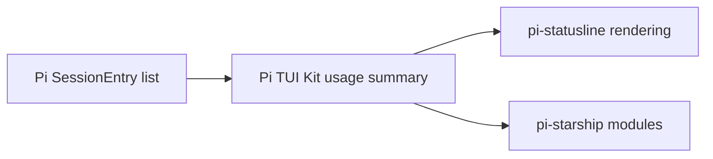

# Share footer usage summarization

## Goal

Replace the byte-identical footer usage implementations in `pi-statusline` and `pi-starship` with one focused Pi TUI Kit API while preserving totals, cache-hit calculations, rendered output, and standalone package compatibility.

## Context

`packages/pi-statusline/src/usage.ts` and `packages/pi-starship/src/usage.ts` are byte-identical, as are their tests. Both aggregate assistant, tool-result, compaction, branch-summary, and explicit usage entries and derive the latest assistant cache-hit rate. Both consumers already depend on `@narumitw/pi-tui-kit`, satisfying the Kit admission rule that a public abstraction have at least two compatible consumers.

Applicable rules:

- Pi TUI Kit must own only the common session-display calculation; statusline and starship retain rendering and module policy.
- Packaged extensions **MUST** remain independently installable.
- After raising a consumer's Kit floor, run root `npm install`, verify `npm ls @narumitw/pi-tui-kit`, then typecheck.
- Public API and package metadata changes require documentation, Changesets, pack inspection, and coordinated release ordering.
- Publishing requires separate explicit approval.

## Architecture

## Non-Goals

- Do not move footer rendering, segment configuration, subscription labels, or status-module policy into Kit.
- Do not create a new generic utility package for this one shared concept.
- Do not change which session entries contribute usage or how zero values are represented.

## Unknowns

- Whether the smallest supported API is a focused Kit subpath only or a root export plus subpath.
- The exact Changeset levels and release ordering needed for Kit and both consumers.

## Risks

- Consumers can fail at runtime if their declared Kit floor predates the new export.
- A broader public API than necessary creates permanent maintenance obligations.
- Moving tests without retaining consumer rendering coverage could miss visible regressions.

## Plan

- [ ] Run both existing usage suites and capture representative statusline and starship rendered output as the behavioral baseline.
- [ ] Confirm the two implementations and tests still represent the same complete concept; stop and keep them local if either consumer has acquired different entry or cache semantics.
- [ ] Choose the smallest focused Pi TUI Kit module and export surface that both consumers can import without unrelated APIs; document the public type and semver decision.
- [ ] Move the current aggregation implementation and its contract tests into Pi TUI Kit without changing supported entry types, zero handling, total cost, or latest-assistant cache-hit calculation.
- [ ] Replace both consumer-local implementations with the Kit import while retaining statusline rendering tests and starship module/lifecycle tests.
- [ ] Update Pi TUI Kit API documentation, package exports, and any package layout documentation required by `docs/readme-conventions.md`.
- [ ] Add coordinated Changesets for the public Kit API and the consumer releases; do not publish or dispatch a release workflow without explicit approval.
- [ ] Raise the `pi-statusline` and `pi-starship` Kit dependency floors to the release containing the helper, run root `npm install`, and verify `npm ls @narumitw/pi-tui-kit` resolves the intended version.
- [ ] Run focused Kit, statusline, and starship usage/rendering/lifecycle tests; verify every usage-bearing entry, zero-token behavior, latest-assistant rate, totals, and visible footer text match the baseline.
- [ ] Build all three workspaces, run `npm run check` and plain `npm test`, and verify no tracked generated output differs unexpectedly.
- [ ] Run `npm run package:pack -- pi-tui-kit`, `npm run package:pack -- pi-statusline`, and `npm run package:pack -- pi-starship`; inspect exports, declarations, generated runtimes, dependency floors, and package contents.
- [ ] Smoke both consumers with Pi's Jiti loader against the packed dependency relationship and record test, pack, resolution, and smoke evidence in the handoff.

## Rollback / Recovery

Before publication, revert the Kit export, consumer imports, dependency floors, lockfile, documentation, and Changesets together if standalone compatibility fails. After publication, restore consumer-local aggregation in a patch release if the declared Kit floor cannot support the shared API; do not rewrite or unpublish released versions.

## Completion Checklist

- [ ] The Kit helper has exactly the two confirmed compatible consumers and a focused public contract.
- [ ] Usage totals, zero handling, cost, and latest-assistant cache-hit rate match the baseline.
- [ ] Statusline and starship rendered output is unchanged.
- [ ] Consumer manifests and lockfile require and resolve a Kit version containing the helper.
- [ ] API documentation and Changesets match the final public surface.
- [ ] Focused tests, builds, root checks, package packs, and Pi loader smokes pass.
- [ ] No release was published without explicit approval.
