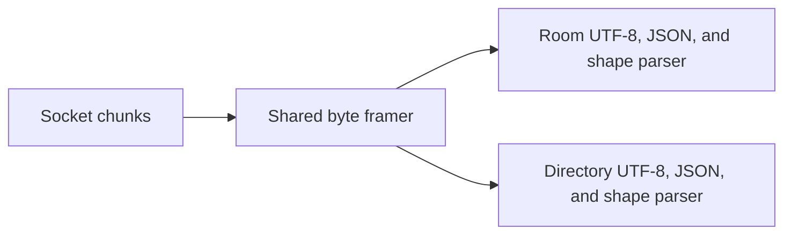

# Share pi-chat length-prefixed framing

## Goal

Use one package-internal implementation for pi-chat's four-byte length-prefixed byte framing without merging room and directory protocols or changing encoded bytes, stream behavior, limits, parsing, or errors.

## Context

`packages/pi-chat/src/protocol.ts` and `packages/pi-chat/src/public-room-directory.ts` separately implement the same big-endian length header, incremental buffering, frame-size enforcement, and payload extraction. Their JSON and message-shape parsers intentionally differ, as do some error messages.

Callers are the room transport in `network.ts` and public-directory transport in `directory-network.ts`. Existing tests cover fragmented input, coalesced room frames, invalid room UTF-8, and oversize rejection.

Applicable rules:

- Treat network payloads as untrusted input.
- Preserve protocol limits and reject oversized frames before buffering their payloads.
- Preserve independently meaningful room and directory parser boundaries and errors.
- Keep the extension independently installable with no new extension dependency.

## Architecture

The shared module returns complete payload bytes. Protocol modules retain JSON serialization, UTF-8 policy, schema parsing, and protocol-specific errors.

## Non-Goals

- Do not merge room and directory message types, parsers, network transports, peer lifecycle, or gossip policy.
- Do not create a reusable networking package.
- Do not alter the four-byte wire header, maximum frame size, or current error messages.

## Risks

- Incorrect buffer ownership can drop or duplicate bytes across chunks or coalesced frames.
- Moving UTF-8 or JSON parsing into the framer can collapse intentionally distinct errors.
- Reset behavior after malformed frames can become externally observable.

## Plan

- [ ] Record baseline encoded bytes and decoder outcomes for room and directory frames, including fragmented headers, fragmented payloads, coalesced frames, empty chunks, oversize headers, invalid UTF-8, invalid JSON, and invalid shapes.
- [ ] Define one package-internal byte-framing API that owns only header encoding, incremental buffering, payload extraction, and maximum-length enforcement.
- [ ] Implement the shared framer with the current four-byte big-endian format and rejection-before-payload-buffering behavior.
- [ ] Adapt `protocol.ts` to use the framer while retaining room JSON serialization, fatal UTF-8 decoding, message parsing, and exact errors.
- [ ] Adapt `public-room-directory.ts` to use the framer while retaining directory JSON serialization, fatal UTF-8 decoding, message parsing, and exact errors.
- [ ] Add symmetric room and directory tests for all framing equivalence classes, especially multiple coalesced frames larger in aggregate than one frame limit and boundaries split at each header byte.
- [ ] Run pi-chat protocol, directory, network, and directory-network tests; verify encoded bytes and exact failures match the baseline.
- [ ] Audit socket cancellation, close, backpressure, decoder ownership, and untrusted-input handling to confirm the extraction did not alter transport lifecycle.
- [ ] Build pi-chat, run `npm run check` and plain `npm test`, and verify no tracked generated output differs unexpectedly.
- [ ] Smoke pi-chat through Pi's Jiti loader and record protocol tests, transport tests, and loader evidence in the handoff.

## Rollback / Recovery

No persisted data is migrated. If any byte sequence, error, limit, or stream transition differs, restore both protocol-local framers before removing the shared module. Do not retain a shared framer that requires room- or directory-specific branches.

## Completion Checklist

- [ ] One internal module owns only byte framing and maximum-length enforcement.
- [ ] Room and directory serialization, parsing, and errors remain local.
- [ ] Encoded bytes, fragmented/coalesced behavior, limits, and malformed-input outcomes match the baseline.
- [ ] Protocol and transport tests pass.
- [ ] Package build, root checks, tests, and Pi loader smoke pass.
- [ ] No public command, setting, dependency, or wire protocol changed.
