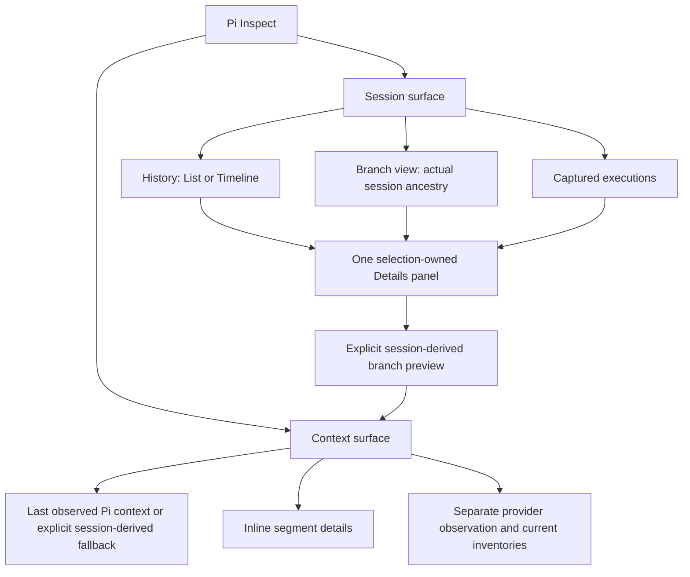

# Pi Inspect interface redesign

## Goal

Make the browser viewer answer two distinct questions without mixing selection, time, or provenance: **Context: what input was observed for the model?** and **Session: what happened during this session?** Preserve read-only inspection, historical evidence, branch navigation, live execution visibility, and existing privacy and lifecycle guarantees.

Implementation and PR delivery were authorized by the user on 2026-10-09. Publication remains out of scope. Retain this plan until the explicit user walkthrough acceptance and interactive CLI smoke (or accepted substitute) are recorded.

## Context

The live viewer was exercised with Playwright on 2026-10-09: Context, Session events, navigator and inspector toggles, entry selection, inspector Prompt/Tools/Context/Skills tabs, List/Timeline, session and context searches, and live-call selection/disclosure. Chrome DevTools was unavailable. Do not store the private viewer URL, token, session contents, or screenshots in this plan or repository.

Relevant implementation evidence:

- `packages/pi-inspect/src/web/app.tsx` owns surface selection, shared entry/call selection, branch fetching, SSE, and pane state; navigator, inspector, and captured calls currently coexist with Context.
- `tree.tsx` and `trace.tsx` independently render the same session-entry ancestry with different pagination and disclosure state. A long sequential history therefore looks like deeply nested work rather than a readable conversation.
- `hierarchy.ts` deliberately retains actual parent IDs and malformed cycles; `withAncestors()` explains why a search can retain many nonmatching rows.
- `inspector.tsx` defaults to metadata/Raw and places historical prompt/tools, current tools/skills inventory, branch projection, and execution evidence behind shared tabs.
- `model.ts` distinguishes observed/session-derived context, branch projections, session entries, and captured execution occurrences. Provider observations have no request association.
- `composition.spec.ts`, `browser.spec.ts`, and the review suites already cover bounded rendering, provenance, selection, cancellation, authentication, retries, malformed records, and responsive layouts.

The live interaction appeared to retain Context while changing the event inspector, but current source `selectEntry()` explicitly switches to events. Resolve this build/runtime discrepancy before treating it as a source defect. The design requirement remains: no screen may imply that unrelated historical selection changes the observed context.

## Architecture

Keep the existing React/Radix browser stack and extension-owned backend. Do not add dependencies, settings, browser-controlled Pi actions, or speculative request correlation.

### Context ownership

Context is the default full-width surface, with source, observation time, leaf, and capture completeness visible. It has its own search, category filters, segment disclosure, and scroll state. Session navigation, execution lists, and event details are not mounted as visible Context panes or offered through unrelated header toggles.

Historical preview is entered only through **View branch context**. It uses the same readable composition renderer but an explicit `Session-derived preview` identity and a **Back to last observed context** action. Preview entry must not change Pi's active leaf. Never describe a branch projection as a captured historical request; unavailable prompt/tool checkpoints remain unavailable. Keep independently observed provider payloads visibly separate and do not imply they belong to the preview or latest context.

### Session ownership

Session has one primary navigation area and one Details panel, not simultaneous duplicate entry trees. Its default History/List is readable, ordered conversation history grouped by user turn within an explicit branch scope; Timeline is an alternate presentation of that same scope. Branch view retains actual ancestry and access to off-branch entries. Captured executions is an in-surface view using the same Details panel, with running/error status visible from Session navigation.

Turn grouping is a display projection, never execution parentage. No group may cross a fork or imply that a session parent is a tool-call parent. Keep snapshot/ancestry ordering authoritative; do not sort solely by timestamps. Missing ancestors, cycles, compaction, summaries, custom messages, and partial inventories remain inspectable and explicitly labeled.

History hides only extension-neutral bookkeeping entries established from Pi's entry semantics; it must not identify private entry types from other extensions. Preserve model-visible custom messages, compaction, branch summaries, model/thinking changes, and errors. Expose **Show internal events** and matching hidden-result counts. Flat search shows matching records without rendering every ancestor; Branch view preserves and labels ancestors. Preserve selected-but-filtered-out navigation without silently clearing filters.

### Details ownership

Click selects; a separate disclosure control expands. Default Details shows message content or execution arguments/result/status, followed by metadata and Raw JSON as secondary disclosures. Use short IDs in the identity header and complete IDs in metadata/copy.

Keep historical prompt, declared tools, skill evidence, prompt updates/diffs, projected contribution, codemode/nested-call evidence, and related navigation reachable through meaningful, source-labeled actions. Current tools/skills inventories belong in Context's secondary information, separate from historical evidence. Use one execution-details location instead of duplicating full results in an execution drawer and Details. Preserve `occurrenceId` selection and real execution parent relationships.

## Non-Goals

- No changes to `/inspect`, its aliases, consent, authentication, transport protocol, capture retention, publication status, or Pi context/tool behavior.
- No persisted preferences or new settings; preserve existing credential-storage behavior.
- No inference of missing request correlation, historical tool visibility, model compliance, token sizes, or execution timings.
- No deletion of advanced inspection capabilities merely to simplify the default view.

## Applicable rules and verification

Apply `docs/extension-conventions.md` and `docs/readme-conventions.md` to these touched areas before implementation:

| Area | Applicable MUST rules | Named verification |
| --- | --- | --- |
| Browser asynchronous ownership | Release owned work at its boundary; do not continue with replaced session/runtime context; cancel underlying owned tasks, not only stale rendering | **Test** delayed selection, view exit, disposal, replacement, terminal authentication/generation failures; **Review** every changed await, controller, timer, stream, and owner |
| Package boundaries | Keep implementation package-owned, independently installable, and free of extension-to-extension dependencies | **Validator** `npm run check:boundaries` through root check; **Review** imports and extension-neutral event classification |
| Published behavior | Record the affected package and SemVer intent through Changesets | **Review** changeset and release intent; no publishing/tagging/workflow dispatch |
| Documentation | Preserve required README structure, supported interfaces, privacy warnings, and provenance limitations | **Review** implementation/docs capability mapping and fenced-code-aware heading audit |
| Verification | Add deterministic coverage for changed behavior and run both root gates; pack/load when publication contents or runtime loading change | **Test** focused Vitest and Playwright, `npm test`; **Validator** `npm run check`; **Smoke** pack and packaged viewer loading |

The browser is not a Pi TUI replacement; TUI theme/keybinding/widget rules are not applicable to new browser controls. Existing extension command and lifecycle contracts remain unchanged and covered by regression tests. If implementation expands into settings, read `docs/extension-settings.md` completely and revise scope before editing those paths.

## Plan

- [x] Reconcile the running viewer with source by rebuilding browser assets and reopening/reloading the viewer through the supported flow; record actual entry-selection surface behavior without changing an unrelated running session. Acceptance: a clean-build browser test reproduces the source behavior and the discrepancy has an explicit disposition.
- [x] Establish a capability and provenance map from `app.tsx`, `inspector.tsx`, `inline-entry.tsx`, `live-drawer.tsx`, projection code, and `docs/viewer.md`; map each existing feature to its new location. Acceptance: no supported capability disappears, and observed context, branch preview, current inventory, independent provider observation, and execution evidence have separate labels.
- [x] Define and test a pure History projection with branch scope, safe summaries, turn groups, and extension-neutral internal-event classification; inspect installed Pi semantics where needed. Acceptance: deterministic fixtures cover forks, pre-user entries, model-visible custom messages, internal events, errors, compaction, summaries, missing parents, cycles, timestamp ties, and truncated input without mutating raw records or fabricating parentage.
- [x] Separate Context and Session composition/state in `app.tsx` and focused surface modules; retain shared connection ownership rather than duplicating SSE clients. Acceptance: browser tests prove Context has no session panes/live-call list, switching surfaces preserves appropriate search/disclosure/scroll state, and stale pane requests are aborted or reused only under an explicit valid owner.
- [x] Replace duplicate Session navigation with History List/Timeline and alternate Branch view; move filters into the active navigation area and separate row selection from disclosure. Acceptance: browser tests cover readable user/assistant/tool summaries, branch scope, internal-event visibility, direct search matches, keyboard focus, pagination, filtered selection, malformed records, and stable older scroll on live append.
- [x] Rework `inspector.tsx` into content-first Details and move current tools/skills inventory into Context secondary information. Acceptance: browser tests cover every mapped capability, literal/untrusted content, bounded raw/copy, checkpoint-unavailable labels, retry errors, and readable details at narrow widths.
- [x] Add explicit branch-preview navigation using existing projection APIs and the composition renderer; add only the minimal package-owned adapter or additive data needed after auditing existing captures. Acceptance: tests prove preview source/leaf/completeness labeling, unavailable projection handling, return to observed context, late-response rejection, and unchanged active leaf/provider input; preview never attaches an unrelated provider observation.
- [x] Replace duplicate live-call result expansion with a Session Captured executions view and selection-owned Details. Acceptance: tests cover running/completed/error/unfinished calls, real nested parentage, repeated raw IDs, eviction fallback, unavailable correlation/anchors, and jumps to recorded entries without duplicate full-result views.
- [x] Validate responsive layout and asynchronous cleanup across all new views. Acceptance: Playwright covers desktop, narrow/mobile, effective 150% viewport, light/dark, keyboard-only selection/disclosure/drawer dismissal, no horizontal overflow, bounded rendering, selection changes during delayed requests, view exit, unmount, stream termination, replacement, and shutdown.
- [x] Update `packages/pi-inspect/README.md` and `docs/viewer.md` to describe implemented navigation and source distinctions, and add a package Changeset for the user-visible redesign. Acceptance: capability-map review, README heading/scope audit, and changeset review pass without changing registry visibility or publishing.
- [ ] Run final verification and perform a rebuilt live-viewer walkthrough; record command results, semantic audit, screenshots from nonsensitive fixtures, and any accepted limitations. Acceptance: all Completion Checklist items below have evidence, including explicit user acceptance of the redesigned reading flow.

## Execution evidence

- Branch: `narumi/feat/inspect-reading-flow`, based on `origin/main` at `ac4bf078`; no unrelated worktree changes were present.
- Clean-build baseline browser verification passed before editing. The earlier live/source selection discrepancy was not reproduced by the rebuilt fixture; no unsupported source defect was inferred. Rebuilt browser and real Pi lifecycle integration verify the new explicit surface ownership without altering the user's running session.
- Capability/provenance mapping is recorded in `packages/pi-inspect/docs/viewer.md`. New responsibilities live in `entry-summary.ts`, `web/history.ts`, `session-filters.tsx`, `recorded-content.tsx`, `context-inventory.tsx`, and `captured-executions.tsx`; duplicate tree and drawer-result renderers were removed.
- Installed Pi `sessionEntryToContextMessages()` and session-entry declarations were audited: only original bookkeeping entry types are hidden; legacy model-visible messages with role `custom` are preserved. Screenshot/diff review corrected a flat-history false cycle label, retained multi-group filters, provided recorded payloads for non-text messages, bounded mobile summaries before timestamps, and prevented execution selection from fetching unused historical data; deterministic/browser tests cover these cases.
- Focused package tests: **324 passed**. Complete Playwright suite: **86 passed**, including fresh Pi loader/TUI-binding integration, real nested execution results, reload, credential rotation, stop and shutdown.
- Root `npm run check` passed (existing unrelated warnings remain); root `npm test`: **7,997 passed, 2 skipped**. The initial root test run used the wrong Node/npm and failed installation-policy tests; rerunning with the installed runtime pinned by `.node-version` resolved all failures without changing code or npm policy.
- Package `smoke` passed for print/JSON rejection, explicit package-directory RPC loading, trusted discovery, aliases, stop, reload and replacement. No paid provider request was used.
- `npm run package:pack -- inspect` passed. A real local tarball was inspected: browser JS/CSS/HTML, source modules, viewer documentation and MIT notice are included; tests, scripts and node_modules are excluded. No package was published.
- Fenced-code-aware README foundation/order audit passed for **35 packages**. README security warnings and native-projection/provider-stage limitations remain intact.
- Asynchronous semantic audit: one shared stream remains; inactive inline and Details work is aborted; terminal snapshot failure cancels pending entry/branch requests; branch publication validates selection owner and leaf; previews retain only their own bounded captured projection. Snapshot and execution occurrence identities remain authoritative. Settings, credentials, API admission, CLI contracts and model-visible context are unchanged.
- Fixture-only desktop/mobile screenshots and rebuilt browser walkthrough were reviewed; they are generated outside tracked sources and contain no user-session credentials or content.
- **Open:** explicit user acceptance of the rebuilt reading flow. A bare interactive `pi -e ./packages/pi-inspect` cannot be launched by this non-interactive harness; package-directory RPC/print loader smoke and real Pi SDK browser integration passed, but the interactive CLI path or explicit acceptance of that substitute remains required. Do not check those criteria or delete this plan prematurely.

### Review ledger — PR #1525

All feedback pages were fetched; the informational review/activity summaries contain no additional requests. The original diff, commit, instructions and successful initial CI were unchanged when review began. The findings below are independently verified P2 defects introduced or newly exposed by the redesign, not unrelated enhancements. On repeat review, unchanged instructions, commits, prior diff and CI were verified and reused; the first three threads were already addressed in `2af8c4a2` and resolved, with no duplicate replies.

| Feedback | Evidence and relationship to goal | Outcome and verification |
| --- | --- | --- |
| [History navigation](https://github.com/narumiruna/pi-extensions/pull/1525#discussion_r4226671761) | The new effect redirected every call-to-entry selection, overriding explicit History navigation and eviction while reading History | Implemented and validated: redirect only while Captured executions is active; List/Timeline tests cover explicit selection and eviction, while existing execution eviction/anchor navigation regressions pass |
| [Root parent label](https://github.com/narumiruna/pi-extensions/pull/1525#discussion_r4226671767) | Collector roots omit parent fields; the replacement Details row incorrectly equated that absence with unavailable evidence | Implemented and validated: no recorded parent is `none (root)`; explicit invalid/ambiguous evidence takes precedence; tests cover roots, resolved, missing, invalid, overlapping and evicted parents |
| [Anchorless correlation](https://github.com/narumiruna/pi-extensions/pull/1525#discussion_r4226671771) | Collector null anchors need not set an error flag; the new Details text falsely claimed recorded evidence | Implemented and validated: require a recorded anchor and no unavailable flag; tests cover missing, invalid, reused, unrepresented and inherited anchors without inventing request association |
| [Hidden-event count](https://github.com/narumiruna/pi-extensions/pull/1525#discussion_r4226834907) | The new count included selected internal matches retained visibly by History's navigation exception | Implemented and validated: count only internal matches excluded from the policy-visible row set; tests cover all/filtered matches, zero hidden matches, and exception expiry after filter changes |
| [History scope reveal](https://github.com/narumiruna/pi-extensions/pull/1525#discussion_r4226834913) | Inactive History consumed a selection serial while an off-branch row was absent, blocking explicit scoped navigation | Implemented and validated: consume reveal only after row membership succeeds; List/Timeline tests reveal an off-branch leaf beyond 50 rows, retain a visible roving target, and preserve earlier scroll/page across a live snapshot |
| [Collapsed inventory](https://github.com/narumiruna/pi-extensions/pull/1525#discussion_r4226834915) | Moving eager inventory/Data rendering onto default Context newly exposed hidden recursive schema work at the supported 256-tool limit | Implemented and validated: outer/category disclosures gate cards and closed Data bodies unmount previews; a 256-tool fixture verifies zero hidden trees, explicit tool/skill access, bounded Copy availability, cached JSON disclosure, surface-switch state and latest inventory after refresh |

The new suite reproduced six failing assertions on the original commit (four History cases plus root and missing-anchor labels); nine complementary cases already passed. All 15 new cases pass after the fixes; the complete browser suite has 81 passing tests. Root check and all 7,997 active tests pass (2 skipped). Final review audited every changed navigation transition and evidence label; no new asynchronous work, collector semantics, settings, loader, model-input, privacy or API changes. The existing minor Changeset covers these same-PR corrections. Publication and thread replies are tracked on PR #1525; original manual acceptance and interactive-smoke criteria remain open.

Repeat-review evidence: five new regressions failed against `2af8c4a2`; all now pass, and the complete rebuilt browser suite has **86 passing tests**. Root check and **7,997 tests** pass (2 skipped). The existing Changeset covers the corrections; no package metadata, settings, API, collector, Pi leaf or request input changed. Native disclosure handlers own only synchronous local state; unmounting closed bodies releases their DOM and image rendering while existing bounded JSON scopes remain reusable. Reveal setters run only after membership succeeds, avoiding retry loops and ordinary-snapshot scroll resets. Prior feedback remains settled; no deferred feedback or missing design decision was introduced.

## Risks

- Readable summaries may require additional bounded summary data because existing labels often name the model rather than message content. Resolve this before choosing a frontend-only implementation; never fetch every raw entry eagerly.
- Grouping across branches can invent causality or hide evidence. Keep grouping pure and branch-scoped, with raw ancestry available in Branch view and tested independently of execution parentage.
- Navigation changes can regress stale-response handling, eviction fallback, and scroll/focus stability. Keep request ownership and occurrence identity explicit; retain regression coverage rather than deleting tests tied to old selectors without equivalent assertions.
- The live session grows while it is inspected. Use deterministic fixtures for counts, filtering, grouping, and screenshots; live smoke validates integration, not exact totals.

## Completion Checklist

- [x] Focused package deterministic tests pass: `npm --workspace @narumitw/pi-inspect test`; new Vitest tests remain within the configured 5,000 ms limit.
- [x] Rebuilt browser assets and complete browser suite pass: `npm --workspace @narumitw/pi-inspect run build`, then `npm --workspace @narumitw/pi-inspect run test:browser`.
- [x] Root gates pass sequentially: `npm run check` and `npm test`; do not overlap these with a separate Kit build/check.
- [x] Published-content inspection passes: `npm run package:pack -- inspect`; inspect included browser assets, source, bundled documentation, and notices.
- [ ] Package lifecycle smoke passes: `npm --workspace @narumitw/pi-inspect run smoke`; perform package-directory loading with `pi -e ./packages/pi-inspect` in the appropriate interactive user environment without paid provider requests. Record any impractical live path as open until explicitly accepted.
- [x] Final semantic audit passes against the guides and capability map: no new Pi mutations, extension-private assumptions, misleading request association, lost inspection capabilities, secret exposure, unbounded work, or stale-selection rendering.
- [ ] User accepts the rebuilt Context/Session/Details flow after representative browser walkthrough; unresolved material design unknowns have explicit decisions.
- [ ] Handoff lists changed files, applicable guides, checks/smokes, deviations and unverified paths; only then delete this completed plan and report its path.
