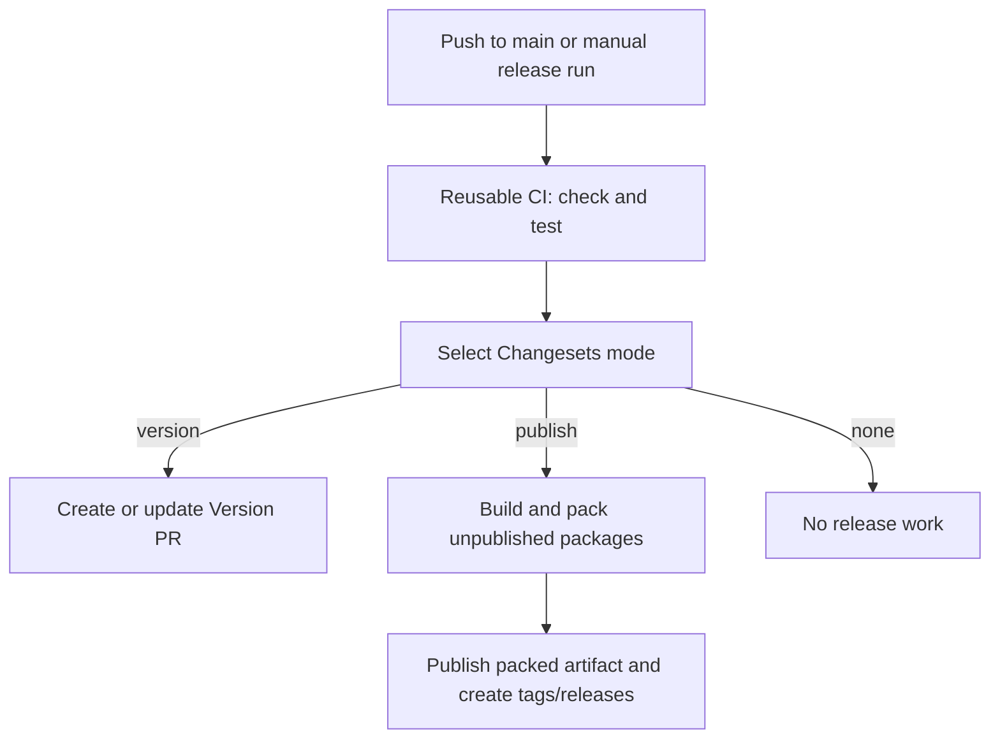

# Release workflow

Main pushes and manual release runs on main run `.github/workflows/publish.yml`; manual runs on other branches skip release work. Its `checks` job calls the reusable CI workflow before Changesets can version or publish packages. Pull requests and manual CI runs still use `.github/workflows/ci.yml` directly. Main pushes do not start a second standalone CI run.

Changesets selects `version` when there are non-empty pending changesets. Merging the Version PR consumes these changesets and updates manifests, changelogs, and the lockfile. The next main push selects `publish` if unpublished package versions remain. Empty-only changesets or no unpublished versions select `none`. CI failure blocks all release jobs.

## Permissions and authentication

Workflow permissions default to none. CI, mode selection, and packing have only repository read access. Versioning has repository and pull-request write access and uses `PAT_TOKEN` so the generated PR triggers CI. Version commits are signed through the GitHub API. Publishing alone has `id-token: write` for npm Trusted Publishing and repository write access for tags and GitHub releases; it does not use the PAT.

Keep npm trusted-publisher bindings pointed at this repository's `publish.yml`. All release jobs disable persisted checkout credentials and dependency caches. Checks run once in reusable CI; the pack job rebuilds packages in its fresh runner but does not rerun checks or tests. The publish job installs dependencies without rebuilding packages and publishes the exact tarballs passed from pack via the same run's artifact ID.

## Failures and recovery

The workflow uses the official Changesets publisher, not `publish-packages:sequential`. The official CLI publishes dependency-ordered batches, stops later batches after a batch failure, and reports an unsuccessful exit. The publish action still creates tags and GitHub releases for packages reported as successful and fails the job afterward. The Actions summary lists successful packages when the action supplies those outputs, including partial-success failures; inspect the action logs if release/tag creation itself fails.

Before retrying, inspect npm versions and the run's tags/releases. A fresh run on main recomputes the plan for unpublished versions instead of replaying an old packed artifact. Do not expect it to repair missing tags/releases for versions that already reached npm; inspect and repair those separately with explicit approval. Do not dispatch a release run merely to validate workflow syntax: it can publish packages.

For the official architecture and APIs, see [Automating Changesets](https://changesets.dev/guide/automating) and [Changesets GitHub Action](https://github.com/changesets/action). The workflow pins all Changesets sub-actions to the same audited revision.
