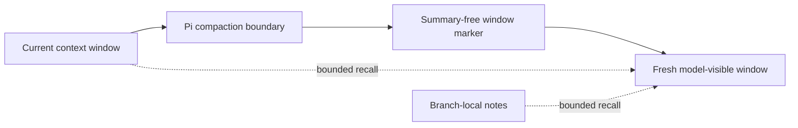

# 🧠 pi-context-management — Summary-Free Context Rollover for Pi

[](https://www.npmjs.com/package/@narumitw/pi-context-management) [](https://pi.dev) [](./LICENSE)

Add opt-in, summary-free context rollover, bounded history recall, and branch-local notes to Pi.
The extension keeps Pi's append-only session while presenting a smaller current window to the model.

> **Experimental:** Context rollover intentionally omits an automatic summary and can lose working detail if the model does not save or recall it correctly. The feature is disabled by default. Keep backups of important sessions and notes.

## ✨ Features

- Starts a fresh model-visible context window without generating a conversation summary.
- Preserves Pi's append-only session and compaction boundaries.
- Exposes four bounded `context_management_*` tools for rollover, capacity, recall, and notes.
- Recalls older plaintext branch history without copying it into separate extension state.
- Stores versioned notes and window lineage on the active branch so forks diverge naturally.
- Fails closed when persisted fingerprints do not match or fingerprint traversal exceeds its limits.
- Provides `/context-management` for status, help, and immediate settings changes.

## 📦 Install

Install persistently from npm:

```bash
pi install npm:@narumitw/pi-context-management
```

Try the published package without installing:

```bash
pi -e npm:@narumitw/pi-context-management
```

Build and try a local checkout from the repository root:

```bash
npm --workspace @narumitw/pi-context-management run build
pi -e ./packages/pi-context-management
```

An unbuilt local checkout has no generated entrypoint and cannot be loaded by package directory.
Do not load a global npm installation and the local workspace at the same time.
Pi extensions run with your user permissions; review third-party extension source before installing it.

## 🚀 Quick start

1. Install or load the extension.
2. Run `/context-management`, open **Settings**, and turn on **Experimental context management**.
3. Ask the model to preserve durable decisions with `context_management_update_notes` before it calls `context_management_start_new_context`.

The four tools become active as one unit after enablement.
Disable other extension-owned compaction routes while using this strategy because multiple `session_before_compact` handlers can conflict.

## 🧭 How it works



At compaction, the extension stores window lineage and fingerprints for Pi's retained suffix.
Its `context` hook hides that exact old suffix only when every expected fingerprint matches.
Older plaintext messages and notes remain available through the recall tool.
See the [context management guide](docs/context-management.md) for rollover, storage, recovery, limits, and privacy details.

## 💬 Commands

Run `/context-management` without arguments to inspect status, enable or disable the feature, and open help.
TUI changes are saved and applied immediately; closing the menu does not undo a completed save.
RPC reports the settings path, while print and JSON modes reject the command.

## 🛠️ Tools

The extension registers these tools but keeps them inactive until enabled:

| Tool | Purpose |
| --- | --- |
| `context_management_start_new_context` | Schedule one summary-free rollover after the current run settles. |
| `context_management_get_context_remaining` | Read Pi's current context usage estimate. |
| `context_management_recall_context` | List, read, or search bounded branch history and notes. |
| `context_management_update_notes` | Write or append one bounded branch-local note. |

The tools activate or deactivate together.
If an exact tool name is unavailable or belongs to another extension, activation fails without replacing that tool and Pi-native compaction remains available.

## ⚙️ Settings

The extension has one optional, global-only settings file:

```text
<getAgentDir()>/pi-context-management.json
```

The normal path is `~/.pi/agent/pi-context-management.json`.
There is no environment-variable or project-level override.

```json
{
  "enabled": true
}
```

`enabled` defaults to `false`.
Direct file edits apply on the next `session_start`, including `/reload`, resume, or fork; menu changes apply immediately.
Missing settings do not create a file.
Malformed, invalid, oversized, or symlinked files remain unchanged and use the safe disabled default until repaired and reloaded.
Menu saves preserve unknown fields, serialize within the Pi process, and publish through a same-directory atomic rename with private temporary-file permissions.

## 🔒 Security and privacy

Pi session files store notes and context metadata as plaintext with the rest of the local session.
Anyone who can read the session can read those notes.
The recall tool sends selected history or notes to the active model provider as a tool result; it does not detect or redact secrets already present in messages or notes.

Tool output, branch scans, settings, notes, and persisted metadata are bounded.
Terminal controls are stripped from rendered or model-visible extension output.
The extension does not read provider credentials or request headers and makes no network request of its own.

## 🚧 Limitations

- Pi chooses compaction thresholds and the retained suffix, so usable capacity can differ from the model-facing estimate.
- Summary-free rollover depends on the model preserving and recalling important information correctly.
- Continuation starts in a later model turn rather than resuming atomically inside the interrupted turn.
- Other extensions that also handle `session_before_compact` can conflict; disable their compaction route while this extension is enabled.
- Malformed, unsupported, or unrelated persisted entries are ignored rather than migrated or rewritten.

## 🗂️ Package layout

```text
packages/pi-context-management/
├── src/                    # Authoritative extension, tools, state, settings, and UI
│   └── index.ts            # Thin repository entrypoint
├── dist/                   # Generated TypeScript runtime loaded by Pi
├── scripts/                # Deterministic runtime builder
├── docs/                   # Detailed operating guide
└── test/                   # Lifecycle, persistence, loader, and real-runtime coverage
```

The published package loads `dist/index.ts`; `src/index.ts` remains the authoritative repository entrypoint.

## 🔎 Keywords

Pi extension, context management, context window, summary-free compaction, memory, notes, history recall.

## 📄 License

[MIT](LICENSE)
