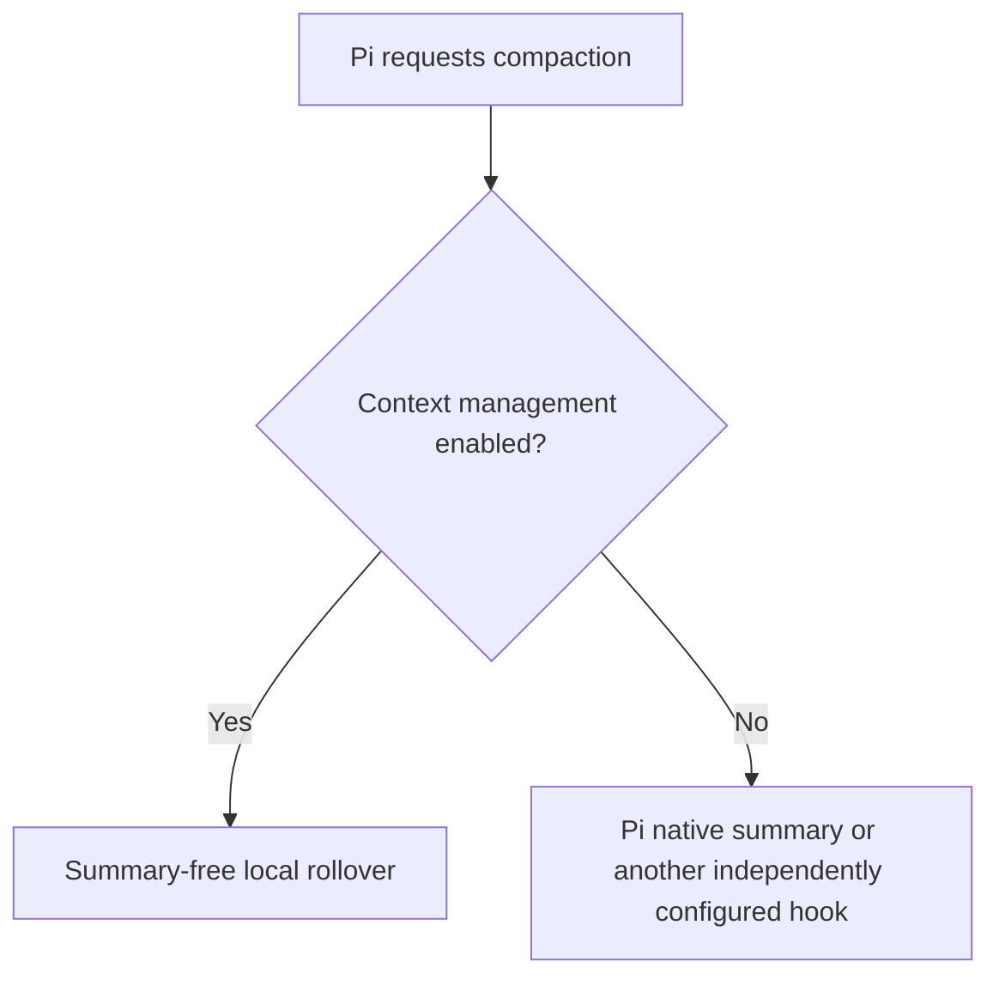
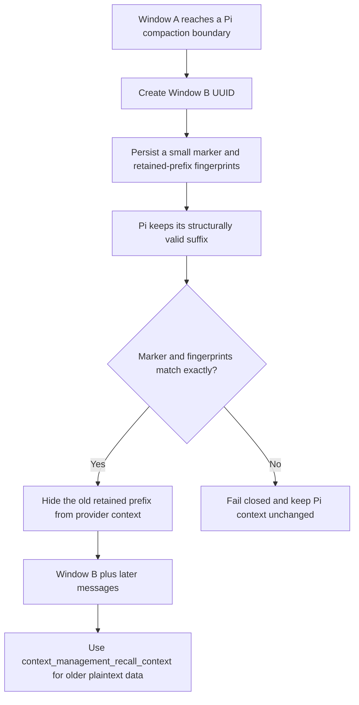
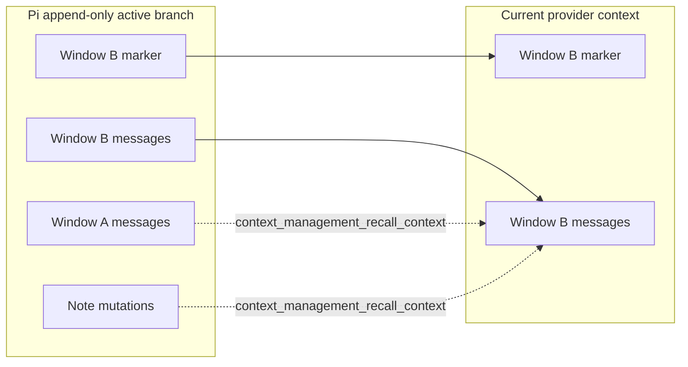

# Experimental context management

> **Experimental:** This feature changes model-visible context and can lose working detail when the
> model does not save or recall it correctly. It is disabled by default. Keep backups of important
> sessions and notes.

Experimental context management is a Pi-native, summary-free rollover strategy.
Pi keeps the append-only session, while the extension starts a smaller model-visible context window
and lets the model retrieve older plaintext history or branch-local notes with tools.

## Enable the experiment

Edit the global settings file shown by `/context-management`, normally
`~/.pi/agent/pi-context-management.json`:

```json
{
  "enabled": true
}
```

You can also turn on **Experimental context management** in `/context-management` → **Settings**. Direct
file edits apply on the next `session_start`, including `/reload`, resume, or fork. Menu changes apply
immediately. Pi shows a warning once per active session.

The default is `false`. When enabled, the extension handles Pi compaction with summary-free local
rollover. Disable other extension-owned compaction routes while using it because multiple
`session_before_compact` handlers can conflict. This extension does not inspect or coordinate with
other extensions.



## Tools

All four tools are active only while the experiment is enabled. Their `context_management_` namespace
avoids generic registration collisions. Their definitions intentionally omit system-prompt snippets
and guidelines; one hidden, versioned context contract provides stable model guidance. If another
extension owns any exact tool name, activation fails as a unit, keeps the other extension's tool
active, warns the user, and leaves Pi-native compaction in control.

### `context_management_start_new_context`

Request one fresh context window after the current agent run settles:

```json
{
  "reason": "The current window is almost full"
}
```

The tool schedules one rollover and asks Pi to stop after the tool batch. Sibling tool calls may still
finish before the agent becomes idle. Pi stops only when every result in a mixed batch requests
termination. If another model turn runs first, the extension still compacts after settlement. A
successful post-request turn suppresses the duplicate hidden next turn; a turn ending in an error or
output-length cutoff remains eligible for one. If Pi already starts automatic compaction, that
compaction consumes the request; otherwise the extension calls `ctx.compact()` at `agent_settled`.
The scheduled tool result persists the request and target-window identifiers. On session restart or
reload, the extension resumes an unresolved request, completes a persisted compaction's missing
continuation once, and does not repeat work after its continuation, cancellation, or successful-turn suppression marker is present.

Successful compaction moves to the new window and sends a hidden next-turn message asking the model
to continue. Failed compaction keeps the old context, reports one warning, and sends a hidden failure
continuation. Losing any context tool before compaction also fails the pending rollover and falls back
to Pi-native compaction; losing a tool after completion preserves the success continuation but reports
that local recall is unavailable. Either next turn is suppressed when a successful post-request turn
already continued the work. Continuation starts in a later model turn rather than resuming atomically
inside the interrupted turn. Save important information with `context_management_update_notes` before
requesting a new context.

### `context_management_get_context_remaining`

Inspect the active model's current Pi context estimate without changing state:

```json
{}
```

The result contains the current window ID, context-window size, used tokens, remaining tokens, and
remaining percentage when Pi has an estimate. Token values can be `null` immediately after
compaction and before the next provider response.

### `context_management_recall_context`

List, read, or search the active branch's plaintext history or notes:

```json
{
  "source": "history",
  "action": "search",
  "query": "authentication decision"
}
```

```json
{
  "source": "notes",
  "action": "read",
  "id": "project-decisions"
}
```

Accepted sources are `history` and `notes`. Accepted actions are `list`, `read`, and `search`.
`read` requires `id`; `search` requires `query`. Pass a returned `cursor` to continue a bounded list,
search, or long read.

The tool is read-only. It can return model-visible user, assistant, custom-message, and tool-result
content from the active branch, but it excludes extension custom entries and unrelated extension
state. It does not detect or redact credentials, request headers, or other secrets present in
model-visible messages or notes.

### `context_management_update_notes`

Write or append one branch-local note:

```json
{
  "action": "write",
  "note": "project-decisions",
  "content": "Use OAuth with PKCE."
}
```

```json
{
  "action": "append",
  "note": "project-decisions",
  "content": " Refresh tokens remain server-side."
}
```

`write` replaces the selected note. `append` adds the supplied content exactly, without inserting a
separator. The tool does not read notes; use `context_management_recall_context` for that.

## Rollover and storage



The extension preserves Pi's prepared `firstKeptEntryId`, so the session remains structurally valid.
Its `context` hook removes only the exact retained-message prefix recorded in the latest supported
experimental compaction details. A mismatch leaves Pi's context unchanged rather than risking data
loss.

The model-visible compaction marker contains no conversation summary. It identifies the first,
previous, and current window and reminds the model to use the context tools. Enabling, disabling, and
each rollover create intentional prompt-prefix epochs; ordinary turns within an epoch retain the same
ordered tool definitions and existing message prefix.



Window lineage is stored in versioned custom state and compaction details. Notes are stored as
versioned append-only mutations and rebuilt from the active branch, so a fork inherits its ancestor's
notes and then diverges naturally. The extension does not copy raw conversation history into its own
state.

## Limits

Limits are fixed to keep session growth and tool responses bounded:

| Boundary | Limit |
| --- | ---: |
| Note name | 128 characters with no terminal controls |
| One note mutation | 16 KiB UTF-8 |
| Active notes | 64 names and 256 KiB total |
| Notes branch replay | 100,000 entry visits and 4,194,304 scan units per request |
| Recall query | 512 characters |
| Recall search page | 20 matches |
| History branch traversal | 100,000 entry visits per request |
| History compaction attribution | 8,388,608 persisted-detail scan units per request |
| Context lineage, mode, and rollover recovery | 100,000 combined entry visits and 8,388,608 persisted-detail scan units per operation |
| History read scan | 4,194,304 scan units per selected item |
| History search scan | 4,194,304 scan units across indexed characters and visited values per request |
| Retained-message fingerprints | 512 levels per message, plus 4,194,304 scan units and 8 MiB serialized across one creation or projection operation |
| Recall response | 32 KiB and 1,000 lines |

Long reads and additional list or search matches use cursors. History actions fail explicitly when
an applicable entry-visit, read-scan, search-scan, or response limit is reached instead of continuing
unbounded work. Fingerprint-limit failures cancel experimental compaction rather than falling through
to Pi's summarizer. Malformed or unsupported persisted versions are ignored individually.

## Compatibility transitions

Malformed, unsupported, or unrelated persisted entries remain untouched and are ignored. Enabling
this package starts or resumes only lineages that use its `context_management_*` tools and
`pi-context-management-*` persisted identifiers.

Disabling the experiment at idle appends one deterministic hidden deactivation transition in each
owning session and then removes the four tools. A non-initiating idle session publishes its durable
transition before its next input is persisted; a no-input continuation queues the same transition at
its next context boundary. During an
active run, the current contract and tools remain available through settlement; the extension then
publishes deactivation before removing the tools. An accepted but
unfinished rollover reports a failure continuation at that boundary instead of being discarded, while
a rollover that already completed retains its success continuation and reports that context tools are
unavailable. Re-enabling before settlement cancels the pending tool-removal transition and leaves an
accepted rollover scheduled. This stops future summary-free rollover without deleting entries, so
existing Pi markers and retained messages remain readable. Re-enable after
settlement to append a new activation transition and regain local recall tools.

Local notes and plaintext history are independent of the selected provider and model. Context usage
always reflects the currently selected model.

## Privacy and security

Pi session files store notes and context metadata as plaintext with the rest of the local session.
Anyone who can read the session can read those notes. `context_management_recall_context` sends selected
history or notes to the active model provider as a tool result. Do not store secrets that should not
reach that provider.

Retrieved text is bounded and terminal controls are removed at the result boundary. Provider
credentials, request headers, and unrelated extension state are not recallable through this package.
Recall does not detect or redact secrets or headers that users, models, or tools placed in model-visible
messages or notes.

## Runtime limits

Pi remains responsible for thresholds, overflow recovery, `/compact`, session publication, and the
structurally retained suffix. Pi calculates its pre-turn compaction threshold from internal context
before the extension's provider-facing filter, so the retained suffix can still reduce the effective
window budget even when the provider does not receive it. Context-remaining values are estimates and
can reflect this difference.

The extension does not provide an external history service, provider cache lineage, exact
body-after-prefix token accounting, or same-turn continuation. Treat it as a portable experimental
workflow built only on Pi's public extension APIs.
