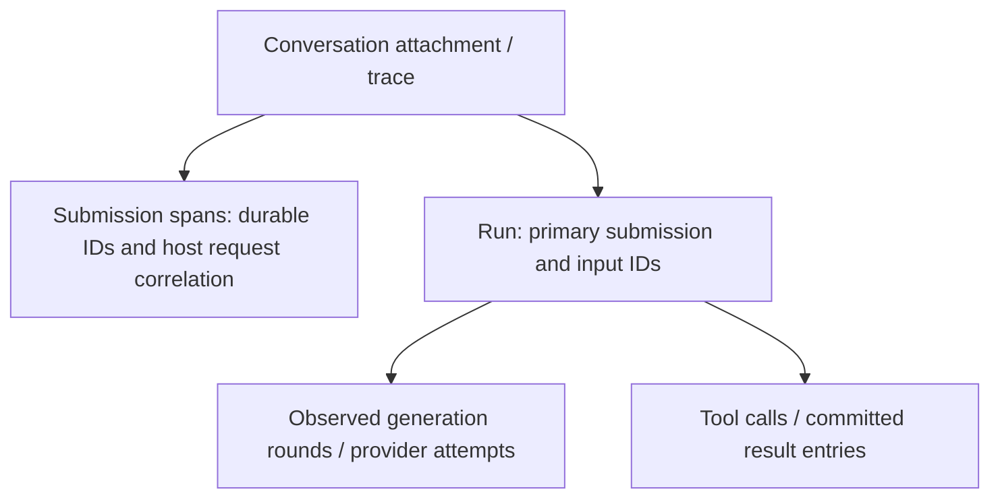

# Durable tracing

Import `createPiLangfuseDurableConversation` from `@narumitw/pi-langfuse/durable` to observe one existing conversation. This entry uses public durable APIs, the existing Langfuse backend, sanitizer and shared-runtime ownership; it does not create an `AgentSession`, load coding-agent registration, or install a durable extension.

> **Experimental compatibility:** this adapter targets exactly `@earendil-works/pi-durable@1.0.4`. Its upstream APIs can change without notice. Do not upgrade durable without the checks below.

## Compatibility

| Interface | Supported dependency | Node.js | Verification |
| --- | --- | --- | --- |
| Root default extension and `createPiLangfuseSession` | Existing coding-agent peer contract (`*`); regression suite uses 1.1.0 | Follow coding-agent's engine floor (currently >=22.19.0) | Existing extension, session, runtime, root-export and Jiti tests |
| `/durable` | pi-durable 1.0.4; Chord ^1.0.4; pi-ai compatible with durable's ^1.0.4 dependency | >=22.19.0 | Real Harness, synthetic provider, Memory/JSONL storage and packed consumer tests |

The coding-agent, durable and Chord peers are optional because each entry only needs its own runtime. Install durable and Chord explicitly for `/durable`. They are host peers rather than adapter-owned execution dependencies so the host's experimental Harness and Context APIs stay aligned. The adapter and host must resolve the same durable module instance: public `watchEvents(harness, ...)` is bound to that instance's Harness observation state. Separate npm roots or bundled runtime copies do not guarantee this identity; use one host install scope, and check `active`/`onError` when attaching. Durable behavior and packed-consumer checks pass on Node 22.19.0, 22.23.1 and 26.5.0.
The Langfuse SDK independently requires Node >=20, but that is not sufficient for these Pi runtimes. The current tested host combination is durable 1.0.4, Chord 1.1.0 and Pi AI 1.1.0. Pi AI's nominal transcript types must resolve consistently with the host's durable dependency resolution; do not pass a Models collection from an incompatible Pi AI release.

For an upstream upgrade, inspect the release README and public root exports/types, then review `watchEvents`, snapshot overflow, `Submission.status()`, read-only transactions, committed message projections and cancellation semantics. Update the exact durable peer and test dependency together. Run the focused durable and coding-agent suites, `npm run check`, `npm test`, `npm run package:pack -- langfuse`, packed consumer tests on supported Node versions, and the package-directory Pi loading smoke. Never replace removed public APIs with private imports or coding-agent event casts.

## Minimal host example

Install `@narumitw/pi-langfuse`, `@earendil-works/pi-durable@1.0.4`, `@earendil-works/chord@^1.0.4` and a compatible `@earendil-works/pi-ai`.

```ts
import { BACKGROUND_CONTEXT, withCancel } from "@earendil-works/chord/context";
import {
  createLangfuseRuntime,
  createPiLangfuseDurableConversation,
} from "@narumitw/pi-langfuse/durable";

// The host already owns harness, conversation, provider credentials and authorization.
const runtime = await createLangfuseRuntime({
  config: { environment: "production" },
  // Uses standard Langfuse environment variables unless env: false is supplied.
});
const observation = withCancel(BACKGROUND_CONTEXT);
const tracing = await createPiLangfuseDurableConversation(runtime, {
  harness,
  conversationId: conversation.id,
  context: observation.context,
  sessionId: hostConversationId, // Globally meaningful host session/conversation identity.
  userId: accountId,
  applicationId: "support-service",
  captureContent: false,
  submissionCorrelation: (record) => ({ requestId: record.requestId }),
  onError: (stage) => reportTracingStage(stage), // Fixed diagnostic stage, not secret-bearing error prose.
});

// Only the host submits, waits, resumes, aborts, retries or otherwise drives execution.
const submission = await conversation.submit({
  type: "input", content: userPrompt, requestId: incomingRequestId,
}, executionContext);
const result = await submission.wait(executionContext);
// Optional: reconcile committed status and answer after a gap or late request attachment.
await tracing.observeSubmission(submission.id);

// Ends observation only. Neither call cancels or resumes durable work.
observation.cancel();
await tracing.dispose();

// Once all application conversations/controllers are finished:
await harness.close(BACKGROUND_CONTEXT); // Host-owned durable lifecycle.
await runtime.shutdown();               // Host-owned shared exporter lifecycle.
```

The root-export coding-agent example in the [README](../README.md#-host-application-embedding) remains unchanged. A process can share the same runtime across both adapters.

## API and ownership

`createPiLangfuseDurableConversation(runtime, options)` returns a controller with `active`, `closed`, `observeSubmission(id, correlation?)`, and idempotent `dispose()`. The host supplies an existing `Harness`, conversation ID and observation `Context`. Failed initialization returns an inactive controller and reports a fixed `onError` stage. Observation, projection, exporter and callback failures do not propagate into agent/tool execution or response delivery. Explicit `createLangfuseRuntime()`, `runtime.flush()` and `runtime.shutdown()` remain fallible administrative APIs; handle their errors separately from application responses.

For custom exporters and deterministic tests, `/durable` also exports `createLangfuseRuntimeFromBackend(backend)` and the `TraceBackend`, `Observation`, `ObservationAttributes` and `ObservationType` types. The managed runtime owns that backend's flush/shutdown lifecycle; controllers borrow it. A custom backend must preserve parent relationships and provide its own exporter-level credential masking; the adapter still applies its bounded content projections before invoking it.

One controller owns one conversation attachment. Duplicate simultaneous attachments through the same loaded adapter are rejected fail-open, without detaching the original controller. Use one loaded package instance and one controller per conversation. A new attachment after disposal or process restart starts a new observation trace, not a continuation of a persisted tracing checkpoint.

Disposal cancels its independently derived observation context, joins initialization and observer detachment, and closes open descendants as observation-interrupted warnings. It never flushes or shuts down a shared runtime. Runtime shutdown rejects new attachments, disposes its controllers before exporter shutdown, and drains completed spans. Harness closure or observation cancellation also detaches the controller and resolves `closed`. Neither disposal nor attachment changes paused recovery or execution cancellation.

The host owns storage opening/closing, model/provider setup, submission deduplication, execution contexts, authorization, tenant boundaries and recovery decisions. Tracing performs status reads and read-only `harness.commit(tx => tx.entry(id))` transactions; these append no entries and do not enable scheduling. It never calls `Submission.wait()`, `resume()`, execution abort, submit, retry, compact or finalize APIs. Host callbacks own any asynchronous work they start; callback rejections are contained, but the adapter cannot cancel arbitrary callback-owned work.

## Correlation and observation hierarchy



A conversation span is open for the attachment's lifetime. Runs end on `run_end`; submissions end only from committed `done` or `unanswered` status. `turn_end` is not submission completion. A steer can join an existing run, and multiple submissions can share one committed answer. Queued follow-ups start separate runs. A run is keyed by its primary input submission, not by generation task IDs that change between rounds.

`sessionId` is the host conversation/session dimension; its fallback is the numeric durable conversation ID, which is not globally unique across storage sessions. `applicationId`, `userId`, bounded `metadata`, `traceName` and `onTraceId` belong to the conversation attachment. Metadata keys beginning with `pi.` are reserved. IDs and custom metadata are exported even with content capture disabled; use pseudonymous identities where appropriate.

`submissionCorrelation(record)` snapshots request/user/application correlation when a submission is first observed. Its default request ID is the durable record's `requestId`, and user/application IDs inherit conversation defaults. `observeSubmission(id, correlation)` can supply or update correlation while that submission span is still open; completed spans are immutable and repeated observations do not create another span. It ignores submissions from another conversation. For race-free primary-run correlation, supply `submissionCorrelation` at attachment rather than relying on a post-submit override. The primary submission's correlation applies to its run and generation/tool children; steered submissions keep independent correlation on their own spans, without changing the run's primary identity.
Per-submission users are observation metadata (`pi.user.id`), not Langfuse's trace-wide user dimension. The native Langfuse `userId` remains the conversation's user so a steer/request cannot rewrite another request's trace-wide identity.

## Content and privacy

`captureContent` defaults to `true`, matching the existing session API; pass `false` when content must remain local. Capture uses the shared bounded sanitizer: each input/output and metadata projection has a cumulative 64 KiB serialized UTF-8 budget, and scalar names/model/user/session fields are bounded separately. Bounds apply only to tracing copies, never durable entries, provider context, tool execution inputs/results or caller responses.

| Durable data | Trace projection |
| --- | --- |
| Submitted input and final answer | Committed model messages from submission `entry` and `answer` IDs; no reconstruction from streamed fragments |
| Assistant generation | Committed `EntryRecord.model`, text/thinking/tool-call blocks; model/provider identity and stop reason; error bodies omitted |
| Image blocks and embedded data URIs | MIME identity/omission markers; no base64 payload |
| Tool call | Committed start arguments, tool name and call ID; no running-output capture |
| Tool result | Successful committed model content and severity from `isError`, optional numeric usage/cost; error bodies and opaque details/nested calls omitted |
| Usage | Finite nonnegative input/output/cache-read/cache-write/total token and cost buckets from committed assistant/tool messages |
| Errors | Status/severity, allowlisted built-in unanswered reason codes and structural task/submission IDs; no raw provider error strings, arbitrary submission reason/detail, task-failure prose or retry errors |
| Provider configuration and headers | Never inspected or projected |
| Compaction/custom entry data | Not captured |

Error-result bodies are replaced by omission markers. For successful tool results, the adapter reads only the public `ToolResultEntry.data.diagnostics` count to omit the final rendered diagnostic block, which can contain raw error/credential prose. This covers tool/env throws, validation and hook failures, blocked/unavailable tools, recovery/abort results, returned errors and successful tools with diagnostics. The committed transcript is never changed; upgrades must re-audit the public result shape and rendered-diagnostic placement.

The sanitizer omits opaque continuation signatures, removes embedded base64 data URIs, and masks recognized credential fields such as `apiKey`, authorization, cookies, credentials, passwords, secret keys and access/refresh tokens. The production backend also masks configured Langfuse keys. These rules are not a universal secret scanner: arbitrary user text, tool output, error-looking tool content or host correlation data can still contain secrets. The host must avoid supplying secrets in arbitrary content, enforce export authorization, and use metadata-only capture where required. No provider-configuration objects or arbitrary diagnostic payloads are passed to the exporter.

## Snapshots, overflow and recovery

Initial attachment always establishes a snapshot baseline, not historical replay. Existing entries are marked seen; the adapter does not fabricate generations or tool starts from old entries, partial messages or tool slots. An active run can be represented as a snapshot-observed span with incomplete history. In-flight and queued submission IDs are reconciled using safe status reads. To observe an already completed submission, explicitly call `observeSubmission(id)`; its committed input/answer become a snapshot-observed summary, without invented round history or timestamps.

Durable keeps at most 100 undelivered watch frames. Overflow delivers a fresh snapshot: the adapter increments `pi.durable.resync_count`, marks history incomplete, closes open generation/tool observations as interrupted, and reconciles known/current submission IDs. It keeps an identifiable ongoing run but marks it incomplete; a missing run closes with an unknown-boundary warning, not an inferred success/abort. Missing frames are never evidence that activity did not happen. Previously unknown submissions that both began and finished inside a dropped interval cannot be discovered from the snapshot; hosts can retain their IDs and explicitly reconcile them.

During one attachment, committed entry IDs, terminal submission IDs, primary run identities and tool-call/round identities suppress identifiable repeated completions. Snapshot entries are not replayed. Spans after a gap have observation-time boundaries, not reconstructed execution timestamps. The adapter does not claim complete retry counts, exact request timing, exactly-once delivery, or trace continuity across crashes/reopen. Reopen leaves scheduling paused until the host explicitly drives work; attaching tracing cannot activate it. No tracing state is written into durable storage.

## Known limitations

The public event stream has no stable run UUID or generation-start task ID. Generation indices describe observed requests/rounds, not guaranteed historical ordinal numbers, and a nonstreamed response can have only an observed completion-time span. Missed attempt/tool activity cannot be recovered exactly. Generation input wire payloads, time-to-first-token, response headers, compaction history, cross-conversation subagent trees and historical usage totals are not synthesized. Conversation traces can be long-lived; dispose at the host conversation lifecycle boundary to complete them. Delivery is subject to exporter failures and process crashes, with no persistent exactly-once outbox.
