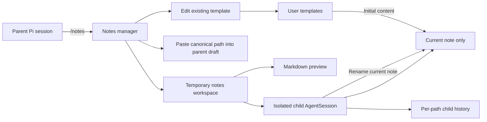

# 📝 Pi Notes — Global Agent-Assisted Markdown Notes

[](https://www.npmjs.com/package/@narumitw/pi-notes) [](https://pi.dev) [](./LICENSE)

`@narumitw/pi-notes` is a Pi extension for browsing and editing user-owned Markdown notes across projects, folders, and worktrees. Each note opens in a focused workspace with an isolated embedded agent and a live Markdown preview.

## ✨ Features

- Keeps every managed item as an equal Markdown note without built-in note types.
- Discovers notes and user-managed templates dynamically under Pi's configured agent directory.
- Creates a blank or templated note immediately under a collision-safe temporary name without asking for a filename.
- Lets the embedded agent proactively rename the current note when its purpose becomes clear.
- Opens notes directly or inserts a selected note's canonical absolute path into the parent editor without replacing its draft.
- Edits existing templates with cancellation and stale-write protection.
- Shows a fullscreen split Chat/Preview workspace on wide terminals and fullscreen tabs on narrow terminals.
- Gives the embedded agent only tools scoped to the currently open note.
- Persists a separate child conversation for each normalized note path without replacing the parent Pi session.
- Creates, renames, and updates managed Markdown with traversal, symlink, stale-revision, and same-process race checks.

## 📦 Install

Install the extension permanently:

```bash
pi install npm:@narumitw/pi-notes
```

Try it without installing permanently:

```bash
pi -e npm:@narumitw/pi-notes
```

From this repository, install dependencies, build Pi TUI Kit, and load the local package:

```bash
npm install
npm run build --workspace @narumitw/pi-tui-kit
pi --no-extensions --no-skills -e ./packages/pi-notes
```

Pi extensions execute with the same filesystem and process permissions as Pi. Review the package before enabling it; the embedded tool allowlist is a model capability boundary, not an operating-system sandbox.

## 🚀 Quick start

Run Pi in TUI mode, then open the manager:

```text
/notes
```

Choose **Open a note…**, **Create a note…**, **Paste a note path…**, or **Manage templates…**. Existing note names appear only after opening the dedicated note list. New notes can be blank or copy a Markdown template found at `${getAgentDir()}/pi-notes/templates/`; the extension opens the note immediately as `untitled.md`, an available numbered variant, or a generated fallback, then the embedded agent renames it when the note's purpose is clear. The extension does not seed templates.

## 🧭 How it works



Opening a note temporarily switches the terminal to a dedicated fullscreen workspace whose title is the note's relative path. On wide terminals, the mouse wheel scrolls the Chat or Preview pane under the pointer; on narrow terminals, it scrolls the active pane. Closing the workspace aborts child work, disposes the child session, and restores the unchanged parent conversation and editor.

All data is below `getAgentDir()`, which honors `PI_CODING_AGENT_DIR`:

```text
${getAgentDir()}/pi-notes/
├── notes/        # Markdown notes
├── templates/    # User-managed initial content
└── sessions/     # Per-note embedded-agent history
```

New managed directories use mode `0700` and newly created notes use `0600` where the platform supports Unix modes. Existing permissions and files are not changed.

## 💬 Commands

`/notes` opens the browse/create manager and accepts no arguments. It requires Pi TUI mode and rejects RPC, print, and JSON modes.

The manager rescans notes and templates when each screen opens. Its first level contains actions only; **Open a note…** shows the current note list on a separate screen. **Paste a note path…** resolves the selected regular file again, closes the manager, and inserts its canonical absolute path at the parent editor's current cursor without replacing the existing draft. Paths containing terminal or display-direction controls are rejected because Pi's paste handling cannot preserve them safely.

**Manage templates…** opens an existing template in a Pi-style multiline editor. The editor preserves leading and trailing whitespace and hides terminal controls as spaces without changing their raw values. It rejects pasted text containing an ambiguous bracketed-paste terminator rather than silently reordering it. Because terminal paste framing cannot represent a literal terminator unambiguously, the first save after a paste asks you to review the content and press save again. Cancelling or submitting unchanged content returns to the manager without writing. A changed template is published atomically only if its revision is still current; if another process changed it, Pi Notes preserves that external content, reports the conflict, and refreshes the manager.

Creating a note copies the selected template exactly once and does not ask for a path. Pi Notes tries `untitled.md`, `untitled-2.md`, and further numbered variants before using a generated fallback, without overwriting an existing note or reusing a temporary path that has child-session history. Later template changes do not classify or alter the created note.

## Embedded assistant

The child session inherits the parent's selected model and thinking level when that model is available through a separate Pi model runtime. It loads no discovered extensions, skills, prompt templates, themes, context files, shell, or general filesystem tools.

The child receives only these tools:

- `read_current_note` reads the open note and returns its relative path and revision.
- `edit_current_note` replaces one unique exact fragment using the latest revision.
- `replace_current_note` replaces the complete open note using the latest revision.
- `rename_current_note` renames the open note using the latest revision and a new relative `.md` destination.

The content tools accept no path, and the rename tool accepts no source path. A batch containing `rename_current_note` executes in source order. To rename and change content in one response, the assistant must call rename first and then at most one content mutation with the same latest revision; renaming preserves that revision. Any later mutation must wait for the preceding content mutation's returned revision. A successful rename updates the live workspace title and keeps subsequent tools bound to the renamed note. Templates affect initial note content only and never become skills, prompt instructions, persistent types, or durable template associations.

## 🔒 Security and privacy

- The managed notes-root path, note content, child prompts, tool results, and relevant child conversation history are sent to the selected model provider when the embedded agent runs.
- Model and credential configuration is read from Pi's configured agent directory. A provider registered only in another extension's in-memory runtime is not inherited.
- Child history remains on disk under `pi-notes/sessions/` until the user removes it.
- Note and template operations reject absolute paths, traversal, special files, and symlinked managed paths. Rename refuses an existing destination and paths deeper than the discovery limit so renamed notes remain available in menus. Same-directory temporary files and atomic publication preserve the previous content when a managed write fails.
- Revision checks detect stale writes and renames, but another process can still change a file immediately around publication; this extension does not provide cross-process locking or an OS sandbox.
- Note paths and content are treated as untrusted terminal text and sanitized only for display; raw Markdown content and valid raw file identities remain unchanged on disk.
- The extension has no delete operation. Removing or disabling the package leaves `getAgentDir()/pi-notes/` untouched.

## 🚧 Limitations

- Notes and templates must be regular `.md` files no larger than 45,000 UTF-8 bytes or 1,800 lines.
- Discovery shows at most 1,000 files, descends at most 16 directories, and reports at most 100 scan issues per pass.
- Each note path supports at most 100 saved child-session files. The visible transcript is bounded to the latest 200 messages and 50,000 characters.
- A rename keeps the currently open child conversation, but reopening the renamed note starts a separate child conversation unless the new path already has history. Renaming a note outside the extension has the same path-associated behavior.
- Parent-only dynamic providers and runtime-only provider state are unavailable to the child; use a provider reconstructable from Pi's normal model and credential files.
- There is no manual rename UI, delete operation, tags, backlinks, full-text index, direct `/notes <path>` route, template language, settings, or bundled skill.
- Template management edits existing files only; create, rename, delete, agent-assisted template work, and Pi's external-editor shortcut are not supported.
- Cross-process locking, large notes, rich-text editing, attachments, synchronization, and collaborative editing are not supported.

## 🗂️ Package layout

```text
packages/pi-notes/
├── src/           # Extension, storage, child session, manager, and workspace
│   └── index.ts   # Thin Pi entrypoint
├── test/          # Storage, isolation, command, lifecycle, and TUI coverage
├── README.md
└── LICENSE
```

## 🔎 Keywords

pi, pi-extension, notes, markdown, embedded-agent, tui

## 📄 License

[MIT](./LICENSE) © narumiruna
