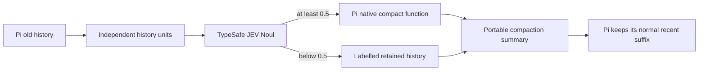

# 🧠 pi-typesafe-compact — Select History with TypeSafe Before Pi Compacts It

[](https://www.npmjs.com/package/@narumitw/pi-typesafe-compact) [](https://pi.dev) [](./LICENSE)

Use TypeSafe AI's JEV Noul evaluator to choose older Pi history units, then pass only that selected context through Pi's native `compact()` function and the model already active in Pi.
Pi still owns compaction timing, recent-history retention, `/compact`, summary generation, and overflow recovery.

## ✨ Features

- Evaluates old user, assistant, thinking, tool-call, tool-result, shell, custom, and summary content as independent units.
- Does not force a tool call and its tool result to share one decision.
- Uses explicit `jev-latest` Noul probabilities with a fixed `0.5` summarize threshold.
- Calls Pi's native `compact()` function with the exact model and thinking level active when compaction starts.
- Retains rejected units as bounded labelled JSON inside a portable Pi compaction summary.
- Reevaluates previously retained units during repeated extension compaction.
- Falls back to Pi-native compaction when configuration, evaluation, bounds, or summarization fails.
- Stores the TypeSafe API key in a private extension-owned settings file and offers masked TUI setup.

## 📦 Install

Install persistently from npm:

```bash
pi install npm:@narumitw/pi-typesafe-compact
```

Try the published package without installing it:

```bash
pi -e npm:@narumitw/pi-typesafe-compact
```

Try a local checkout from the repository root:

```bash
npm install
npm run build --workspace @narumitw/pi-tui-kit
pi -e ./packages/pi-typesafe-compact
```

The TypeSafe SDK requires Node.js 20 or newer.
Pi extensions run with your user permissions, so review third-party source before installing it.
Do not load another custom compaction extension at the same time because Pi runs every registered compaction hook in extension order.
When loading this repository's root package, run `pi config` before setting a TypeSafe key and disable the `pi-codex-compact` and `pi-context-management` extension entrypoints.

## 🚀 Quick start

1. Run `/typesafe-compact` in Pi's TUI.
2. Open **Settings** and choose **Set TypeSafe API key**.
3. Enter or paste the key in the masked input and submit it.
4. Continue working normally or run Pi's built-in `/compact`.

The extension applies the saved key immediately.
If no valid key is configured, Pi-native compaction remains active.

## 🧭 How it works



JEV decides only whether each unit belongs in the compressed portion; it does not define the summary prompt or write the summary.
Pi's native `compact()` function receives the selected units as canonical labelled context, plus the previous compressed summary, file-operation state, split-turn grouping, and any custom `/compact` instructions.
Compared with Pi-native compaction, the selected context is the only compaction input policy this extension replaces.
Provider-native tool messages are not replayed across the boundary; retained tool calls and results become independently labelled data so either can survive without creating an invalid provider conversation.

## 💬 Commands

`/typesafe-compact` opens the manager and accepts no arguments.
In TUI mode it provides Settings, Status, Help, masked key replacement, and confirmed key removal.
Escape returns from nested screens, and Ctrl+C closes the interaction without changing settings.

RPC reports whether a key is configured and the manual settings path, but never requests plaintext secret input.
Print and JSON modes reject the command.
Pi's built-in `/compact [instructions]` remains the command that requests compaction.

## ⚙️ Settings

The extension uses one global-only file:

```text
<getAgentDir()>/pi-typesafe-compact.json
```

The normal path is `~/.pi/agent/pi-typesafe-compact.json`:

```json
{
  "apiKey": "your-typesafe-api-key"
}
```

There is no project setting or environment-variable override.
Missing files and missing keys leave Pi-native compaction active without creating a file.
Settings reload on every `session_start`, including startup, `/reload`, resume, new session, and fork.

TUI saves apply immediately, preserve unknown JSON fields, serialize within the current Pi process, and publish by same-directory atomic rename.
Temporary and replacement files use mode `0600` on POSIX.
Malformed, invalid, oversized, non-regular, or symlinked settings files are not overwritten; repair the file and run `/reload`.
Separate Pi processes do not share a mutation lock, and a detected concurrent edit is rejected.

## 🔒 Security and privacy

Selective compaction has two external data boundaries:

1. Candidate old-history units are sent in bounded batches to TypeSafe AI for JEV Noul evaluation.
2. Units selected by JEV are sent to the model provider already active in Pi for summarization.

The API key is sent only to the configured TypeSafe API endpoint by `@typesafe-ai/sdk`.
It is never included in TypeSafe state, model prompts, Pi session entries, status text, notifications, logs, or errors.
The manager displays only **Configured** or **Missing**, and masked TUI entry never falls back to plaintext RPC input.

Retained history and the active-model summary are written to the Pi session as normal compaction content.
They may contain prompts, tool arguments, tool output, paths, code, and secrets that were already present in the conversation.
Image bytes are not sent by this extension; image units use MIME type and size placeholders.

| Boundary | Limit |
| --- | ---: |
| Candidate history units | 512 |
| One ordinary unit | 32 KiB characters |
| Serialized tool-result text | 2,000 characters plus a truncation marker |
| One TypeSafe batch | 24 units and 96 KiB serialized |
| Pi-native summary input | Active model input budget, capped at 512 KiB |
| Retained structured history | 256 KiB |
| Final model-visible summary | 512 KiB |
| Persisted extension details | 768 KiB |
| Settings file | 64 KiB |

When a bound cannot be satisfied safely, the extension warns in UI-capable modes and delegates the complete operation to Pi-native compaction instead of silently dropping the custom summary.

## 🚧 Limitations

- The fixed Noul threshold and rubric are not configurable in the first release.
- JEV batches have bounded local context rather than one unbounded view of the whole session.
- Tool-result text follows Pi-style compaction truncation, and image content is represented only by metadata.
- Retaining many units can save less context than Pi-native compaction; hard bounds eventually force native fallback.
- A TypeSafe authentication or network failure is discovered at compaction time; setup does not make a validation request.
- TypeSafe evaluation usage is stored as token counts in compaction details but is not added to Pi provider cost totals.
- Extension-owned summary calls cannot inherit Pi's configured summarization retry policy because the public extension context does not expose it; a transient summary failure delegates the operation to Pi-native compaction.
- Branch summaries created by `/tree` are not customized.
- Multiple custom compaction routes can all perform remote work before Pi keeps only the last result. This extension cannot inspect another extension's state, so disable every other compaction extension with `pi config` before configuring its TypeSafe key.

## 🗂️ Package layout

```text
packages/pi-typesafe-compact/
├── src/
│   ├── index.ts              # Thin Pi entrypoint
│   ├── typesafe-compact.ts   # Lifecycle and compaction orchestration
│   ├── evaluator.ts          # TypeSafe JEV Noul batching and decisions
│   ├── history-units.ts      # Independent units, bounds, and persistence
│   ├── summary.ts            # Pi native compact adapter
│   ├── settings.ts           # Private atomic credential settings
│   └── menu.ts               # Manager and masked setup flow
├── test/                     # Settings, evaluation, lifecycle, UI, and loader tests
├── package.json
├── tsconfig.json
└── LICENSE
```

The package publishes its TypeScript source entrypoint for Pi's Jiti runtime and needs no build step.

## 🔎 Keywords

Pi extension, Pi coding agent, TypeSafe AI, JEV, Noul, context compaction, selective summarization, message history, tool history.

## 📄 License

[MIT](LICENSE)
