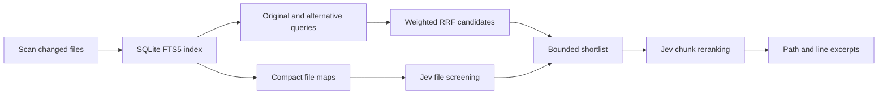

# 🔎 pi-typesafe-search — FTS5 Search with Jev Semantic Reranking

[](https://www.npmjs.com/package/@narumitw/pi-typesafe-search) [](https://pi.dev) [](./LICENSE)

Search workspace files through an incremental SQLite FTS5 index, then let TypeSafe Jev decide which source excerpts are semantically useful for the query.
It stores no embeddings and requires no vector database or downloaded model.

## ✨ Features

- Incrementally indexes changed text files with SQLite FTS5 and preserves exact source line ranges.
- Combines the original query and optional alternative phrasings with weighted Reciprocal Rank Fusion.
- Uses compact Jev file screening to recover some candidates that lexical search would miss.
- Uses final Jev Noul probabilities to accept and rank complete source chunks.
- Splits Markdown, prose, and source files near headings, paragraphs, code fences, and declarations.
- Keeps credentials and per-workspace indexes under the Pi agent directory with private POSIX permissions.
- Supports cancellation, progressive candidate widening, bounded inputs, and bounded Pi tool output.

## 📦 Install

Install the extension permanently:

```bash
pi install npm:@narumitw/pi-typesafe-search
```

Try it without installing permanently:

```bash
pi -e npm:@narumitw/pi-typesafe-search
```

Build and try this package locally from the repository root:

```bash
npm --workspace @narumitw/pi-typesafe-search run build
pi -e ./packages/pi-typesafe-search
```

An unbuilt local checkout has no generated entrypoint and cannot be loaded by package directory.

pi-typesafe-search requires the Node.js runtime supported by the current Pi release and its built-in SQLite FTS5 support.
Pi extensions run with the Pi process's user permissions, so install only trusted packages.
This extension reads workspace source, stores indexed copies locally, and sends selected file maps and candidate excerpts to TypeSafe.

## 🚀 Quick start

Create the user settings file with private permissions:

```bash
mkdir -p ~/.pi/agent
umask 077
cat > ~/.pi/agent/pi-typesafe-search.json <<'JSON'
{
  "apiKey": "YOUR_TYPESAFE_API_KEY"
}
JSON
```

If Pi uses a custom agent directory, place `pi-typesafe-search.json` in the directory returned by Pi's agent configuration instead.
Restart Pi or run `/reload` after changing the file.

Ask Pi to search a directory semantically, for example:

```text
Find where this project restores an authenticated user session.
```

Pi can call `jev_search` with the original request and alternatives such as `refresh token` or `session cookie`.

## 🧭 How it works



The first search indexes accepted files under the selected directory.
Later searches still scan file metadata but only reread and rechunk files whose identity, size, or high-resolution modification time changed.
If a changed file cannot be read safely, its prior complete index row remains available for a later retry but is excluded from the current search.
The extension does not run a watcher or background indexer.

FTS5 supplies fast lexical recall.
The caller may provide alternative phrasings, and Pi gives the original query twice the RRF weight of each alternative.
Jev then screens compact file maps and makes the final yes/no relevance judgment over shortlisted full chunks.
A final Jev probability of at least `0.5` is treated as a match; this initial policy should be evaluated on each corpus rather than treated as a universal semantic threshold.

## 🛠️ Tools

### `jev_search`

Search a directory inside the current workspace.

| Parameter | Required | Description |
| --- | --- | --- |
| `query` | Yes | The question or concept to find. |
| `path` | Yes | A workspace-contained directory, relative to the current workspace or an absolute path that resolves inside it. A leading `@` is ignored for Pi compatibility. |
| `alternatives` | No | Up to four concise lexical aliases or paraphrases supplied by the calling model. |
| `limit` | No | Maximum excerpts, from 1 to 20; defaults to 8. |

The result shows `path:startLine-endLine`, the Jev probability, and the excerpt.
Result details retain bounded index counts, lexical rank, file score, final score, model name, request count, and TypeSafe token usage.
The model-visible result is limited to Pi's 50 KB and 2,000-line tool limits.

Tool failures are observable errors.
Escape or another Pi abort cancels filesystem and TypeSafe work between bounded SQLite operations; a synchronous SQLite statement already in progress finishes before cancellation is observed.

## ⚙️ Settings

The extension reads one user settings file and never creates or modifies it:

```text
<getAgentDir()>/pi-typesafe-search.json
```

Supported document:

```json
{
  "apiKey": "YOUR_TYPESAFE_API_KEY"
}
```

The file must be a regular, non-symlinked UTF-8 JSON file no larger than 64 KB.
On POSIX it must use `0600` permissions.
A missing or invalid file disables searches without overwriting the file; tool errors and warnings report only the problem, never the key.
Unknown fields are ignored.
Project settings and extension-specific environment-variable aliases are not supported, and the SDK environment fallback is disabled by passing this key explicitly.

Settings reload on `session_start`, including `/reload` and session replacement.

## 🔒 Security and privacy

- Search roots must resolve inside the active workspace; symlinks are not followed.
- `.git`, dependency, build, coverage, virtual-environment, and similar generated directories are skipped.
- `.env*`, private-key formats, common credential files, `pi-typesafe-search.json`, and `*.secret`/`*.secrets` are excluded by filename.
- The canonical Pi agent directory is skipped when it is located inside the workspace and cannot be selected as a search root.
- Binary, invalid UTF-8, non-regular, oversized, and unreadable files are not indexed.
- Indexed source chunks remain on the local machine in private per-workspace SQLite databases.
- TypeSafe receives the query, compact maps for selected files, and shortlisted source chunks.
- The API key is used only for TypeSafe requests and is not written to the index, tool result, logs, notifications, or session details.
- Candidate text is explicitly treated as untrusted data in Jev questions, but model judgments are not a security boundary.

Review both source sensitivity and TypeSafe's data-handling terms before searching confidential repositories.

## 🗃️ Index storage and recovery

Each canonical search root selected inside the workspace receives a separate derived index:

```text
<getAgentDir()>/pi-typesafe-search/indexes/<sha256-canonical-search-root>.sqlite
```

The database stores file metadata, structural outlines, source chunks, FTS terms, and content hashes.
It never stores vectors or credentials.
SQLite WAL mode, transactions, a busy timeout, and per-process mutation ordering protect complete file updates.
Private, cancellable SQLite guard transactions serialize database creation and recovery, while shared per-handle leases prevent replacement recovery until every live process has closed the index.
The operating system releases guards and leases when a process exits, so recovery does not rely on process IDs or stale-lock cleanup; ordinary updates remain coordinated by SQLite writer locks.

Schema or chunk-policy changes rebuild a validated replacement before swapping it into place.
A corrupt derived index is rebuilt automatically when possible.
To force a clean rebuild, exit every Pi process using the workspace, then delete that workspace's `.sqlite`, `.sqlite-wal`, and `.sqlite-shm` files.
Deleting an index never deletes workspace source.

## 🚧 Limitations

- This is not vector search. A relevant passage with no lexical overlap and no useful clue in its file map can still be missed.
- Jev is English-first; CJK and other languages are indexed lexically but may receive less accurate semantic judgments.
- File maps are capped at 80 files per search and final Jev reranking at 40 chunks, so broad repositories should use a narrower `path`.
- A search accepts at most 5,000 files and 50 MB total, and each file must be at most 512 KB.
- Metadata-based incremental checks can miss a deliberately preserved same-size, same-mtime edit until the index is rebuilt.
- SQLite work uses Node's synchronous API and can briefly block the event loop; transactions and corpus limits keep that work bounded.
- There is no watcher, manual index command, custom TUI, project credential, vector index, or downloaded local model.
- TypeSafe availability, rate limits, pricing, and model behavior are external dependencies.

## 🗂️ Package layout

```text
packages/pi-typesafe-search/
├── src/
│   ├── index.ts               # Thin Pi entrypoint
│   ├── typesafe-search.ts     # Tool registration and session lifecycle
│   ├── files.ts               # Safe workspace discovery and text loading
│   ├── chunks.ts              # Natural-boundary chunks and file maps
│   ├── database.ts            # Private SQLite FTS5 storage
│   ├── indexer.ts             # Incremental transactional refresh
│   ├── retrieval.ts           # Multi-query FTS and RRF candidates
│   ├── jev-client.ts          # Batched TypeSafe Noul judgments
│   └── search.ts              # Search pipeline and result policy
├── dist/                      # Generated TypeScript runtime loaded by Pi
├── scripts/                   # Deterministic runtime builder
├── test/                      # Storage, retrieval, lifecycle, and failure tests
├── package.json
├── README.md
└── LICENSE
```

The published package loads `dist/index.ts`; `src/index.ts` remains the authoritative repository entrypoint.

## 🔎 Keywords

Pi extension, Jev, TypeSafe, semantic search, SQLite, FTS5, BM25, reranking, source search, no vector database.

## 📄 License

MIT. See [`LICENSE`](./LICENSE).
